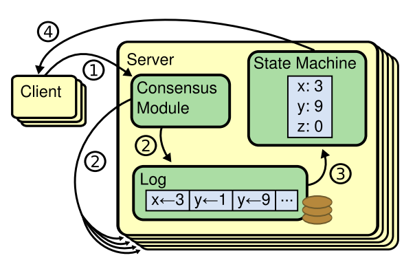

# Raft-共识算法

> 论文链接：[https://pdos.csail.mit.edu/6.824/papers/raft-extended.pdf](https://pdos.csail.mit.edu/6.824/papers/raft-extended.pdf)

`Raft`是一种管理复制日志的共识算法，共识算法的存在能够使得一组机器作为一个连贯的整体进行工作，即使部分成员发生故障也能够继续运行。

`Raft`采用了特定的技术来提高可理解性，包括分解（Raft将领导者选举、日志复制和安全性分开处理）和状态空间压缩。具备一下几项新特性：

* 强邻导者

    `Raft`使用了一种比其他共识算法更强的领导形式，如：日志条目只从领导流向其他服务器，这样大大简化了对复制日志的管理，让raft更易于理解。

* 领导者选举

    `Raft`使用随机定时器来选举领导者。实现的过程是在心跳机制中增加少量内容，这种机制对于任何共识算法都是必需的。

* 成员变更

    `Raft`的集群成员变更机制使用了一种新的联合共识方法，在转换期间两个不同配置的多数群体相互重叠。这使得集群在配置变更期间可以正常运行。

## 复制状态机

共识算法通常再复制状态机的背景下出现，在这种方法中，一组服务器上的状态机计算相同状态的多个副本，即使其中一些服务器发生故障也能继续运行。复制状态机被用于解决分布式系统中的各种容错问题。

复制状态机通常使用一个复制日志来实现，如上图，每个服务器存储一个包含一系列命令的日志，其状态机按顺序执行这些命令。每个日志包含相同顺序的相同指令，因此每个状态机处理相同的命令序列，由于状态机是确定的，它们计算出相同的状态和相同的输出序列。

共识算法需要保持复制日志的一致性，服务器上的共识模块接收来自客户端的命令并将其添加到日志中。它与其他服务器上的共识模块通信，以确保每个日志最终包含相同的顺序的相同请求。即使某些服务器发生故障，一旦命令被正确的复制，每个服务器的状态机按日志顺序处理它们，并将输出返回给客户端。

一个实用的共识算法通常具有以下属性：

* 在所有非拜占庭条件下（包括网络延迟、分区、数据包丢失、重复和乱序）确保安全性

* 在任何多数服务器正常工作并能彼此

