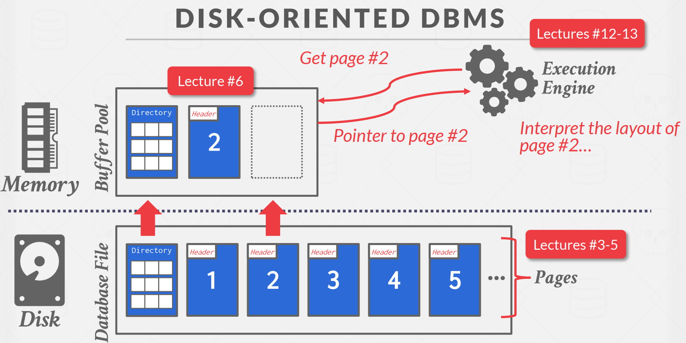
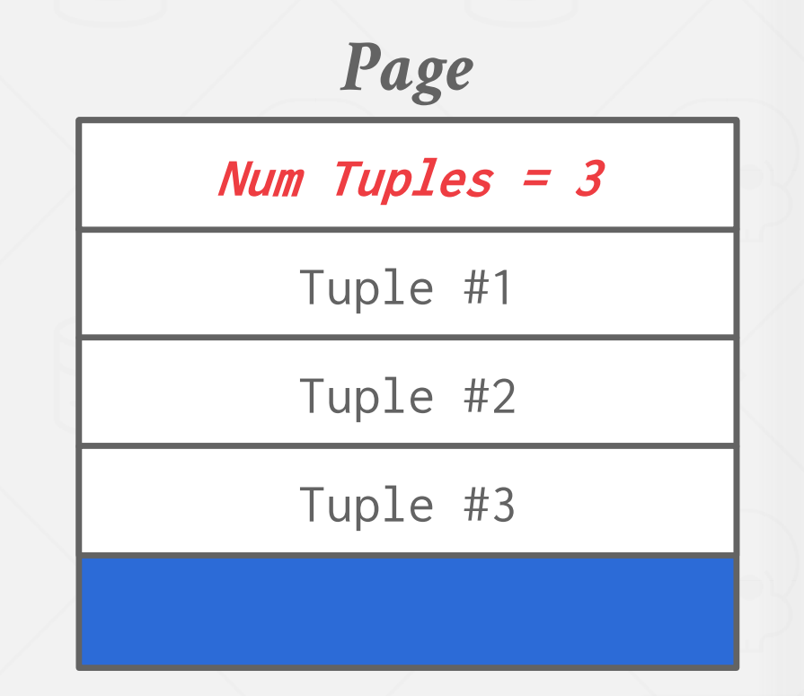

## 01-Relational Model & Relational Algebra 

### 数据库基本概念

数据库管理系统：允许应用在数据库中存储、操作、分析数据信息的一种软件。通常的数据库管理系统（DBMS）支持通过一些数据模型（data model）定义、创建、查询、更新以及数据库的管理工作

数据模型（data model）： 将存储的概念的高级抽象在数据库中，是数据库中描述数据的一种概念集合，能够表明数据的形状、属性等。

* 关系型数据模型：关系型数据库
* 非关系型模型Nosql：key/value、Graph、Document/Object
* 矩阵/向量/列表
* 分层、网络

模式（schema）：是一个逻辑概念，用于组织数据库中的对象。模式中的对象通常包括表、索引、数据类型、序列、视图、存储过程、主键、外键等。

### 关系型模型（Relational Model）

定义了一个数据库抽象层，用于如何替换表示关系以避免数据库维护的开销。

* 三大原则
  * 存储数据库的简单数据结构
  * 数据库的存储由数据库管理系统来实现，无需用户定义数据的存储形式，例如tree等
  * 允许数据使用高级语言，数据库管理系统产生最优的执行策略

关系（table、relation）：包含代表实体属性关系的一种无序集合

元组（tuple）：关系中的属性值表现的集合，值也叫做域（domain）

主键（primary key）：识别唯一元组的方法，是一组关键的属性

外键（foreign key）：允许定义一个关系中的数据如何与另一个关系相关，外键作为一个映射表（交叉引用表）


### 基本语法

* SELECT

  从一个关系中通过某些过滤信息选择出元组的子集，条件通常写在where 后面

  

* PROJECTION（投影）

  使用数据库中的元组重新生成一个关系，只包含某一些特殊的属性。

  把原来的表映射成一个新的表

  

* UNION（联合关系）

  UNION ALL：不去重

  UNION：去重

  联合不同的数据库，但是数据库具有完全相同的属性。

  默认情况下并集允许重复性

* INTERSECT（交集关系）

  两个数据库关系的交集，相同的元组集合

* DIFFERENCE（取补集）

  语法：EXCEPT

* PRODUCT（笛卡尔积）

  语法CROSS JOIN

* JOIN

  

## 02-Modern SQL

### AGGREGATES

> 聚合（aggregations）：类似一个在查询中获取一组元组的函数
>
> AVG、MIN、MAX、SUM、COUNT


```
CREATE TABLE student(
	sid INT PRIMARY KEY,
	name VARCHAR(50) NOT NULL,
	login VARCHAR(50) NOT NULL,
	age INT NOT NULL,
	gpa FLOAT DEFAULT 0
);

INSERT INTO student (sid, name, login, age, gpa) VALUES
(53666, "Kanye", "kanye@cs", 44, 4.0),
(53688, "Bieber", "jbieber@cs", 27, 3.9),
(53655, "Tupac", "shakur@cs", 25, 3.5);

CREATE TABLE enrolled(
	sid 
)
```


* 获取到student表中的注册统计数

```
SELECT COUNT(login) AS cnt FROM student WHERE login LIKE '%@cs';
// 大多数数据库都对count（*）有优化
SELECT COUNT(*) AS cnt FROM student WHERE login LIKE '%@cs';
SELECT COUNT(1) AS cnt FROM student WHERE login LIKE '%@cs';
```

* 多聚合，多个属性的聚合

```
SELECT AVG(gpa), COUNT(sid) FROM student WHERE login LIKE '%@cs';
```

* DISTINCT

  COUNT、SUM、AVG支持DISTINCT，表示只会统计不同的元素，去重

```
SELECT COUNTA(DISTINCT login) FROM student WHERE login LIKE '%@cs';
```

* GROUP BY

  按照group by后面的元组进行select操作

```
// 按照cid的分组来计算gpa的平均值，并聚合cid和平均值两列元素
SELECT AVG(s.gpa), e.cid
FROM enrolled AS e, student AS s
WHERE e.sid = s.sid
GROUP BY e.cid;
```

* HAVING

  在完成group by以后还需要再进行一些筛选，可以使用having

### STRING OPERATIONS（字符串操作）

* 模糊查询

  > 数据库中没有搜索引擎，少用右模糊查询或者全模糊查询，百分号尽量不放在前面，在索引过程当中遵循最左匹配原则

  %：代表一个或多个字符

  _：代表单个字符

* SUBSTRING

  字符串切片操作

```
// 对name这一列中的字符串进行切片操作
SELECT SUBSTRING(name, 1, 5) AS abbrv_name FROM student WHERE sid = 53688;
```

* UPPER：大写

* LOWER：小写

* CONCAT

  连接操作，将字符串拼接起来

```
SELECT name FROM student WHERE login = CONCAT(LOWER(name), '@cs');
```

### OUTPUT REDIRECTION（输出重定向）

将一个查询的结果集建成一个新的表，要求重定向的表是没有被定义的表，同时

* CREATE TABLE

```
# 使用查询建一张表格
CREATE TABLE CourseIds(
	SELECT DISTINCT cid FROM enrolled
);
```

* ORDER BY <cloumn*> [ASC|DESC]

  按照某一列或者多列进行增序或者降序

```
# ORDER BY 1: 根据第一列进行排序
SELECT sid, grade FROM enrolled WHERE cid = '15-721' ORDER BY grade
```

* LIMIT < count > [offset]

  输出count行，从第offset个开始

```
# 从满足条件的第10个开始查找20个学生
SELECT sid, name FROM student
WHERE login LIKE '%@cs'
LIMIT 20 OFFSET 10;
```

### NESTED QUERIES（嵌套查询）

将一个查询或多个查询嵌入到另一个查询当中


对子嵌套的关系进行操作

* ALL：所有的行必须满足子查询中的表达式
* ANY：至少一行必须在子查询中匹配
* IN：等价于=ANY
* EXISTS：只要内部查询产生一个输出记录就返回

```
SELECT name FROM student
WHERE sid = ANY(
SELECT sid FROM enrolled
WHERE cid = '15-445'
);
```

### WINDOW FUNCTIONS（窗口函数）

类似于聚合，但不仅仅是将元组折叠成单个聚合，而是以一种增量的方式计算聚合

* SELECT ... FUNC-NAME(...) OVER(...) FROM table

  使用窗口函数FUNC-NAME，按照OVER的方式对查询的col进行聚合

* 窗口函数种类

  * ROW_NUMBER() ：每一行的行号
  * RANK() ：位置
  * 二者的区别在于，rank可以并列，但是row_number是唯一的

* PARTITION BY  cid：按照cid分组，可以写在over中的条件里面

```
# 先将enrolled表按照cid分组，并按照grade排序
# 再找出每一门课当中的第二名，ranking中第2高成绩的数据
SELECT * FROM (
SELECT *, RANK() OVER (PARTITION BY cid
ORDER BY grade ASC) AS rank
FROM enrolled) AS ranking
WHERE ranking.rank = 2
```

* CTE（COMMON TABLE EXPRESSIONS）

  通用表达式：只在sql语句内部起作用的临时语句

  RECURSIVE：递归调用，不是所有的sql都能够使用递归

```
WITH cteName (col1, col2) AS (
SELECT 1, 2
)
SELECT col1 + col2 FROM cteName

WITH cteSource (maxId) AS (
SELECT MAX(sid) FROM enrolled
)
SELECT name FROM student, cteSource
WHERE student.sid = cteSource.maxId

# CTE递归的调用，很少用，可读性差
WITH RECURSIVE cteSource (counter) AS (
(SELECT 1)
UNION ALL
(SELECT counter + 1 FROM cteSource
WHERE counter < 10)
)
SELECT * FROM cteSource
```

* CTE可以递归调用自身

  

## 03-Database Storage 1

### 基于磁盘的架构

>  数据库管理系统（DBMS）假设数据库的主要存储位置位于非易失性磁盘上。DBMS 的各个组件负责管理在非易失性存储和易失性存储之间的数据移动。

* 数据库系统的设计目标

  > 数据库系统做的操作有点类似于虚拟内存，如下图

  1、系统可以管理超过内存可使用的总内存的数据

  2、由于读写内存十分昂贵，需要尽可能避免数据大量的读写内存造成的性能损耗

  3、尽可能使用顺序存储的方式提高效率

* 为什么不适用操作系统？操作系统的虚拟内存可以进行相关操作

  > 数据库管理系统使用内存映射存储文件的内容到程序的地址空间
  >
  > 操作系统负责文件页面的命中与否，数据库管理系统不需要考虑

  



* 内存映射会遇到的问题（MEMORY MAPPED I/O PROBLEMS）

  * 事务安全Transaction Safety

  * I/O阻塞

    数据库系统不知道内存中有哪些页面，所以在取数据如果发生错误，操作系统会阻塞线程

  * 错误处理

  * 性能问题

结论：数据库管理系统不使用MMAP内存映射

* 数据库进行管理

  问题1、数据库系统如何表示磁盘上的文件数据

  问题2、如何管理内存以从磁盘中来回移动这些页面的数据，数据的读入与写回

### 文件存储

> 数据库系统会使用数据库独有的文件格式在磁盘上存储一个或者多个文件
>
> 操作系统并无法知晓文件的内容

* 存储管理器

  用于维护数据库文件，进行页面调度提升性能，利用局部性原则，组织一系列的页面文件读写

* 数据页面

  > 页面被锁定为固定大小的数据块，可以包含任何内容，不可以包含混合的数据

  硬件页面：存储设备可以保证它原子写出的最小数据或数据块大小，默认大小4KB

  操作系统页面：通常4KB

  数据库页面：512B-16KB

  * 硬件页面是存储设备能够保证正确写入的最大块大小
  * 使用更大的页面可以减少IO，运用到局部性原理，但是不能够确保更大的页面读写是原子的，需要使用一些操作来确保数据不会丢失

* 堆文件heap file

  按照随机顺序存储的无序页面的集合

  包含有获取、创建、写入、删除页面，以及迭代功能

  数据库管理系统维护一张特殊的表格用于定位数据库文件中的页面，也可以称为目录


### 页面Page

* 页面标头

  页面大小

  校验和：检查是否有数据损坏

  数据库管理系统版本：升级系统会更新

  事务可见性：用于进行权限管理

  压缩信息、备份

* 内部组织形式

  * 面向元组tuple的存储方式

    * 方式1

    

    删除其中一个tuple需要进行线性的移动

    无法对可变长度的属性进行存储

    * 方式二、开槽页面slot

    在页面开头存入槽数组，将元组映射到页面的实际位置

    槽页面是从尾端按照顺序存储

    

* Record IDS

  > 每一个元组都有一个唯一的记录ID号

  大部分格式为：页面ID+偏移量，可以使用ctid来获取（数据库中不能有列名为ctid的列） 

  * 每个元组都有元数据，元组头部：可见性信息（元组是否删除）、使用位图表示元组中的空值

```
#在数据库中可以对碎片整理，会填补前面因为元组删除而空余的slot
VACUUM FULL table;
```

## 04-Database Storage 2

### 基于日志的架构

> 数据库管理系统存包含改变元组的日志记录（PUT、DELETE）
>
> 每一条日志记录包含元组独特的ID
>
> PUT：包含元组修改后的内容
>
> DELETE：将元组标记为删除

数据库管理系统在内存页面中存储对元组操作的一些记录，例如修改某一个元组，删除某一个元组，当页面存满以后，记录会被永久保存，并切换到下一个页面，这样的好处可以磁盘IO更少，便于写入

读入的时候，会需要向前不断追溯到最新的记录，读入很慢，在数据库管理系统中会维护一张index的表，映射到元组id的最新记录

* 日志压缩

  因为日志是随着数据库的操作而进行持续增长的，数据库管理系统会定期的压缩页面以减少空间浪费

  通过将多个页面合并（找到记录的最新版本），移除掉不必要的记录

  * 通用压缩（Universal Compation）

    查看两个连续的排序文件，将其组合在一起，随后删除旧的文件

  * 层级压缩（Level Compation）

    类似于2048，层级较低的过多以后，整合压缩成更大的高层文件

* 基于日志的架构有什么缺点

  * 对写功能的放大

    如果需要更新某一个元组，会在查询的过程中压缩，会和压缩过后的页面一起写回，写就被放大了

  * 压缩代价较大

### 元组的存储

4类基本数据类型：整型，浮点（FLOAT/REAL，NUMERIC/DECIMAL），varchar，time

* 高精度的数据
  * Postgres，最终结果使用字符串的别名来表示，需要实现不同数据的拼接，很影响性能


* 大数据：例如大小超过一个页面的数据

  使用其它的页面存储这些更大的页


* 外部资源数据

  一些数据库系统允许存储外部文件的数据，对于这些外部文件，数据库系统无法做到持续性保护以及业务的保护，无法保证外部文件不被修改

* 系统目录

  数据库系统维护数据库的一些表格
