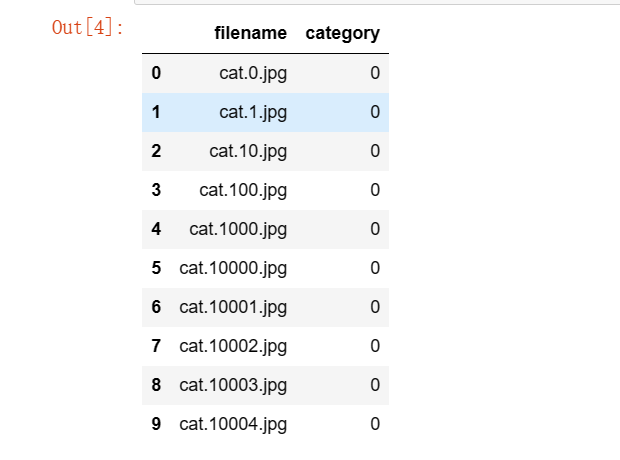
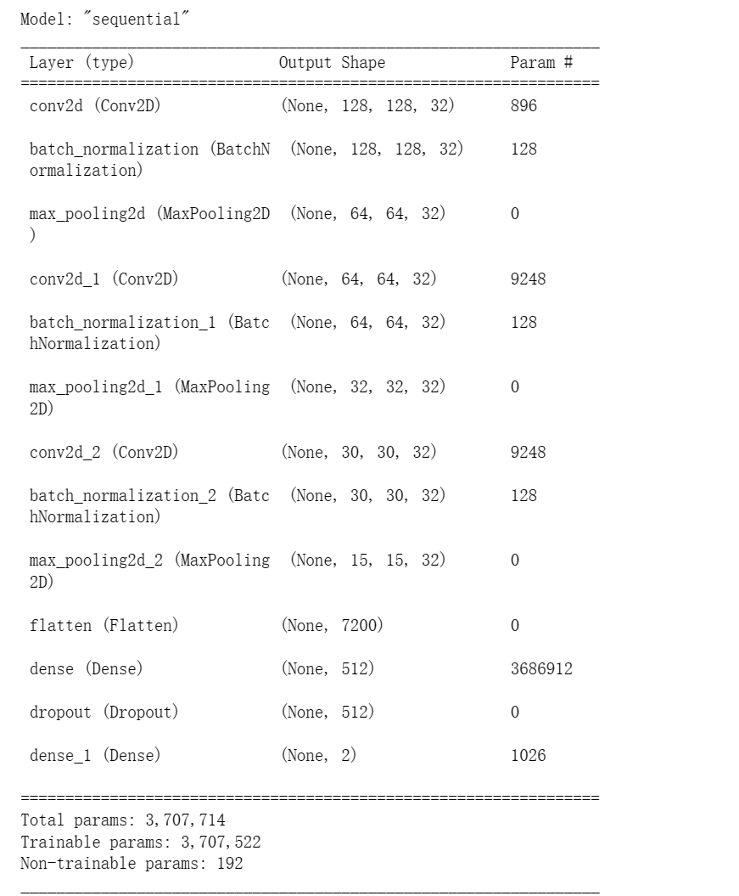
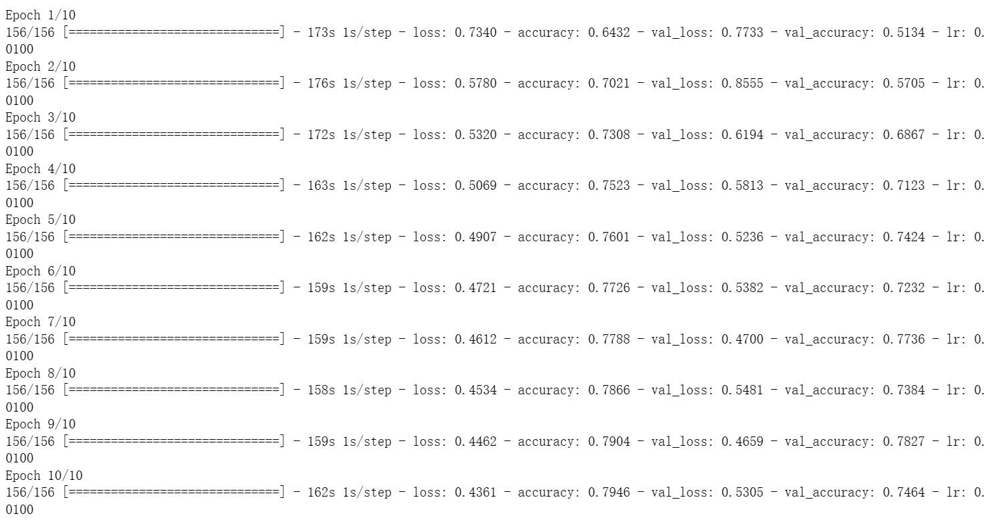

## 实验三、基于tensorflow的猫狗分类

### 一、实验目的

* 掌握如何使用tensorflow/pytorch编程实现模型，并会使用JupyterNotebook或Pycharm完成项目

### 二、实验内容

* 完成猫狗分类的模型的编码实现和模型训练

### 三、实验步骤

* 导入需要的函数包

  ```python
  import numpy as np
  import pandas as pd
  
  from tensorflow.keras.preprocessing.image import ImageDataGenerator, load_img
  from tensorflow.keras.utils import to_categorical
  from sklearn.model_selection import train_test_split
  
  import matplotlib.pylab as plt
  import random
  import os
  ```

* 定义常量

  ```python
  FAST_RUN = False
  IMAGE_WIDTH = 128
  IMAGE_HEIGHT = 128
  IMAGE_SIZE = (IMAGE_WIDTH, IMAGE_HEIGHT)
  IMAGE_CHANNELS = 3
  ```

* 处理数据集文件夹

  ```python
  # 处理数据集
  filenames = os.listdir('train')
  categories = []
  for filename in filenames:
      category = filename.split('.')[0]
      # 将所有图片按照顺序打上标签，如果是dog标记为1，如果是cat标记为0
      if category == 'dog':
          categories.append(1)
      else:
          categories.append(0)
  
  # 将文件名与标签一一对应
  df = pd.DataFrame({
      'filename':filenames,
      'category':categories
  })
  ```

* 查看前十行数据内容

  ```python
  # 查看前十行内容
  df.head(10)
  ```

  

* 随机打开一张图片样本

  ```python
  # 随机打开一张图片样本
  sample = random.choice(filenames)
  image = load_img('train/'+sample)
  plt.imshow(image)
  ```

  

* 处理数据标签

  * 生成训练数据
  * 划分训练集和验证集

  ```python
  df['category'] = df['category'].replace({0: 'cat', 1: 'dog'})
  # 划分训练集和验证集
  df_train, df_valid = train_test_split(df, test_size=0.2, random_state=42)
  df_train = df_train.reset_index(drop=True)
  df_valid = df_valid.reset_index(drop=True)
  
  # 设置Batch Size与训练和验证样本数
  total_train = df_train.shape[0]
  total_valid = df_valid.shape[0]
  batch_size = 128
  ```

* 数据生成器

  ```python
  # 训练集数据生成
  train_datagen = ImageDataGenerator(
      rotation_range=5,
      rescale=1./255,
      shear_range=0.1,
      zoom_range=0.2,
      horizontal_flip=True,
      width_shift_range=0.1,
      height_shift_range=0.1
  )
  
  train_generator = train_datagen.flow_from_dataframe(
      df_train,
      'train/',
      x_col='filename',
      y_col='category',
      target_size=IMAGE_SIZE,
      class_mode='categorical',
      batch_size=batch_size
  )
  ```

  ```python
  # 验证机数据生成
  valid_datagen = ImageDataGenerator(rescale=1./255)
  valid_generator = valid_datagen.flow_from_dataframe(
      df_valid,
      'train/',
      x_col='filename',
      y_col='category',
      target_size=IMAGE_SIZE,
      class_mode='categorical',
      batch_size=batch_size
  )
  ```

* 查看数据生成样本

  ```python
  # 查看数据生成样例
  df_example = df_train.sample(n=1).reset_index(drop=True)
  example_generator = train_datagen.flow_from_dataframe(
      df_example,
      'train/',
      x_col='filename',
      y_col='category',
      target_size=IMAGE_SIZE,
      class_mode='categorical'
  )
  
  plt.figure(figsize=(12,12))
  for i in range(0, 15):
      plt.subplot(5, 3, i+1)
      for X_batch, Y_batch in example_generator:
          image = X_batch[0]
          plt.imshow(image)
          break
  plt.tight_layout()
  plt.show()
  ```

  

* 建立模型

  ```python
  from tensorflow.keras.models import Sequential
  from tensorflow.keras.layers import Conv2D, MaxPooling2D, Dropout, Flatten, Dense, Activation, BatchNormalization
  
  model = Sequential()
  model.add(Conv2D(32, (3, 3), activation='relu', input_shape=(IMAGE_WIDTH, IMAGE_HEIGHT, IMAGE_CHANNELS), padding='same'))
  model.add(BatchNormalization())
  model.add(MaxPooling2D(pool_size=(2,2)))
  
  model.add(Conv2D(32, (3, 3), activation='relu', padding='same'))
  model.add(BatchNormalization())
  model.add(MaxPooling2D(pool_size=(2,2)))
  
  model.add(Conv2D(32, (3, 3), activation='relu'))
  model.add(BatchNormalization())
  model.add(MaxPooling2D(pool_size=(2,2)))
  
  model.add(Flatten())
  model.add(Dense(512, activation='relu'))
  model.add(Dropout(0.1))
  model.add(Dense(2, activation='softmax'))
  ```

* 定义损失函数

  > 使用交叉熵损失函数

  ```python
  model.compile(loss='categorical_crossentropy', optimizer='sgd', metrics=['accuracy'])
  ```

* 查看深度学习网络

  ```python
  model.summary()
  ```

  

  ```python
  # 回调：在模型训练期间的某些点调用的实用程序
  from tensorflow.keras.callbacks import EarlyStopping, ReduceLROnPlateau
  
  earlystop = EarlyStopping(patience=10)
  learning_rate_reduction = ReduceLROnPlateau(monitor = 'val_accuracy',
                                              patience=5,
                                              verbose=1,
                                              factor=0.5,
                                              min_lr=0.00001)
  ```

  ```python
  callbacks = [earlystop, learning_rate_reduction]
  ```

* 开始训练模型

  > 一共完成50个epoch训练，每个epoch含有156个steps

  ```python
  # 模型训练
  FAST_RUN = False
  epochs = 3 if FAST_RUN else 50
  
  history = model.fit(train_generator,
                     epochs=epochs,
                     validation_data=valid_generator,
                     validation_steps=total_valid//batch_size,
                     steps_per_epoch=total_train//batch_size,
                     callbacks=callbacks,
                     workers=12)
  ```

  

* 保存模型

  > 利用model.save_weights与model.load_weights先训练10个epoch，保存模型后，再次加载继续训练20个epoch

  ```python
  # 训练10个epoch并保存模型
  FAST_RUN = False
  epochs = 3 if FAST_RUN else 50
  
  history = model.fit(train_generator,
                     epochs=10,
                     validation_data=valid_generator,
                     validation_steps=total_valid//batch_size,
                     steps_per_epoch=total_train//batch_size,
                     callbacks=callbacks,
                     workers=12)
  
  model.save_weights('weights.ckpt')
  ```

  

  ```python
  # 重新加载模型
  model.load_weights('weights.ckpt')
  # 继续训练20个epoch
  history1 = model.fit(train_generator,
                     epochs=20,
                     validation_data=valid_generator,
                     validation_steps=total_valid//batch_size,
                     steps_per_epoch=total_train//batch_size,
                     callbacks=callbacks,
                     workers=12)
  ```

  

* 对训练的结果进行可视化

  > 对存储的损失值和精度值拟合成曲线

  ```python
  # 可视化训练结果
  fig, (ax1, ax2) = plt.subplots(2, 1, figsize=(12, 12))
  ax1.plot(history.history['loss'], color='b', label='Training loss')
  ax1.plot(history.history['val_loss'], color='r', label='Validation loss')
  ax1.set_xticks(np.arange(1, epochs, 1))
  ax1.set_yticks(np.arange(0, 1, 0.1))
  ax1.legend(loc='best', shadow=True)
  
  ax2.plot(history.history['accuracy'], color='b', label='Training accuracy')
  ax2.plot(history.history['val_accuracy'], color='r', label='Validation accuracy')
  ax2.set_xticks(np.arange(1, epochs, 1))
  
  legend = plt.legend(loc='best', shadow=True)
  plt.tight_layout()
  plt.show()
  ```

  

* 准备测试集

  ```python
  # 准备测试集以及创建测试机
  test_filenames = os.listdir('test1')
  df_test = pd.DataFrame({
      'filename':test_filenames
  })
  nb_samples = df_test.shape[0]
  ```

  ```
  test_datagen = ImageDataGenerator(rescale=1./255)
  test_generator = test_datagen.flow_from_dataframe(
      df_test,
      'test1/',
      x_col='filename',
      y_col=None,
      class_mode=None,
      target_size=IMAGE_SIZE,
      batch_size=batch_size,
      shuffle=False
  )
  ```

* 预测

  > 通过神经网络，对测试集的数据进行预测
  >
  > 选择输出概率最高的做为预测结果

  ```python
  predict = model.predict(test_generator,
                         steps=np.ceil(nb_samples/batch_size),
                         workers=12)
  ```

  ```python
  df_test['category'] = np.argmax(predict, axis=-1)
  
  label_map = dict((v,k) for k,v in train_generator.class_indices.items())
  df_test['category'] = df_test['category'].replace(label_map)
  
  df_test['category'] = df_test['category'].replace({'dog':1, 'cat':0})
  
  df_test['category'].value_counts().plot.bar()
  ```

  

* 查看预测结果

  > 可视化了前三十个预测结果，只有1002一张图片预测错误

  ```python
  sample_test = df_test.head(30)
  sample_test.head()
  dict_1 = {1:'dog', 0:'cat'}
  plt.figure(figsize=(12, 24))
  for index, row in sample_test.iterrows():
      filename = row['filename']
      category = row['category']
      img = load_img('test1/' + filename, target_size=IMAGE_SIZE)
      plt.subplot(10, 3, index+1)
      plt.imshow(img)
      plt.xlabel(filename + '(' + '{}'.format(category) + ')' + dict_1[category])
  plt.tight_layout()
  plt.show()
  ```

  

  

#### 四、总结

* 用自己的话叙述从逻辑回归到神经元工作原理

  逻辑回归工作原理：逻辑回归用于二分类问题，将输入的数据进行处理过后得到一个输出数据，再通过sigmoid函数，通过阈值的设置来判断将输出的数据映射为0，或者是1.

  神经元工作原理：神经元的每一个输入都会对应一个相应的权值，通过神经元后，再经过激活函数，产生输出，常见的激活函数有sigmoid函数，relu函数。


* 给出至少两种常用的激活函数

  Sigmoid激活函数、Relu激活函数

  

* 给出两种池化方式

  最大池化：将输入的图像划分为若干个矩形区域，对每个子区域输出最大值。

  平均池化：将输入的图像划分为若干个矩形区域，对每个子区域输出所有元素的平均值


* 简述卷积神经网络要素：卷积核、池化、特征图

  卷积核：卷积核，是卷积层中用于与输入的矩阵进行卷积运算的单元，通过与卷积核的卷积运算能够提取出原始图像中的一些特征属性。

  池化：池化的重要的目的在于进一步降低网络的整体计算代价，同时也能够在一定程度上降低网络出现过拟合的风险，能够将原始图像矩阵通过一定的池化方式进行压缩。

  特征图：通过卷积层进行与卷积核运算过后所得到的图就称为提取特征后的特征图。

  

* 给出实验用到的模型图示，给出实验中的关键代码并解释

  

  ```
  model = Sequential()
  # 卷积层1，卷积核的大小为（3，3），使用relu激活函数
  model.add(Conv2D(32, (3, 3), activation='relu', input_shape=(IMAGE_WIDTH, IMAGE_HEIGHT, IMAGE_CHANNELS), padding='same'))
  
  # 对数据进行标准化，加快训练速度
  model.add(BatchNormalization())
  
  # 池化层1，使用最大池化的方法，池化尺寸为（2，2）
  model.add(MaxPooling2D(pool_size=(2,2)))
  
  # 卷积层2，卷积核的大小为（3，3），使用relu激活函数
  model.add(Conv2D(32, (3, 3), activation='relu', padding='same'))
  model.add(BatchNormalization())
  # 池化层2，使用最大池化的方法，池化尺寸为（2，2）
  model.add(MaxPooling2D(pool_size=(2,2)))
  
  # 卷积层3，卷积核的大小为（3，3），使用relu激活函数
  model.add(Conv2D(32, (3, 3), activation='relu'))
  model.add(BatchNormalization())
  # 池化层3，使用最大池化的方法，池化尺寸为（2，2）
  model.add(MaxPooling2D(pool_size=(2,2)))
  
  # 扁平层，将多维数据一维化
  model.add(Flatten())
  # 全连接层2，将输入的数据转化为512维度
  model.add(Dense(512, activation='relu'))
  # 删除10%的神经元，将其置为0，防止过拟合
  model.add(Dropout(0.1))
  # 全连接层2，将数据最终转化为2为数据，通过softmax映射成概率值
  model.add(Dense(2, activation='softmax'))
  ```

* 问答

  问题：在训练过程中，学习率是怎样进行调整的？

  回答：使用ReduceLROnPlateau和EarlyStopping配合动态调整学习率，ReduceLRonPlateau函数中有一些列参数可以搭配使用来动态调整学习率。

  ```
  monitor：监测的值，可以是accuracy，val_loss,val_accuracy
  factor：缩放学习率的值，学习率将以lr = lr*factor的形式被减少
  patience：当patience个epoch过去而模型性能不提升时，学习率减少的动作会被触发
  mode：‘auto’，‘min’，‘max’之一 默认‘auto’就行
  epsilon：阈值，用来确定是否进入检测值的“平原区”
  cooldown：学习率减少后，会经过cooldown个epoch才重新进行正常操作
  min_lr：学习率最小值，能缩小到的下限
  ```

  