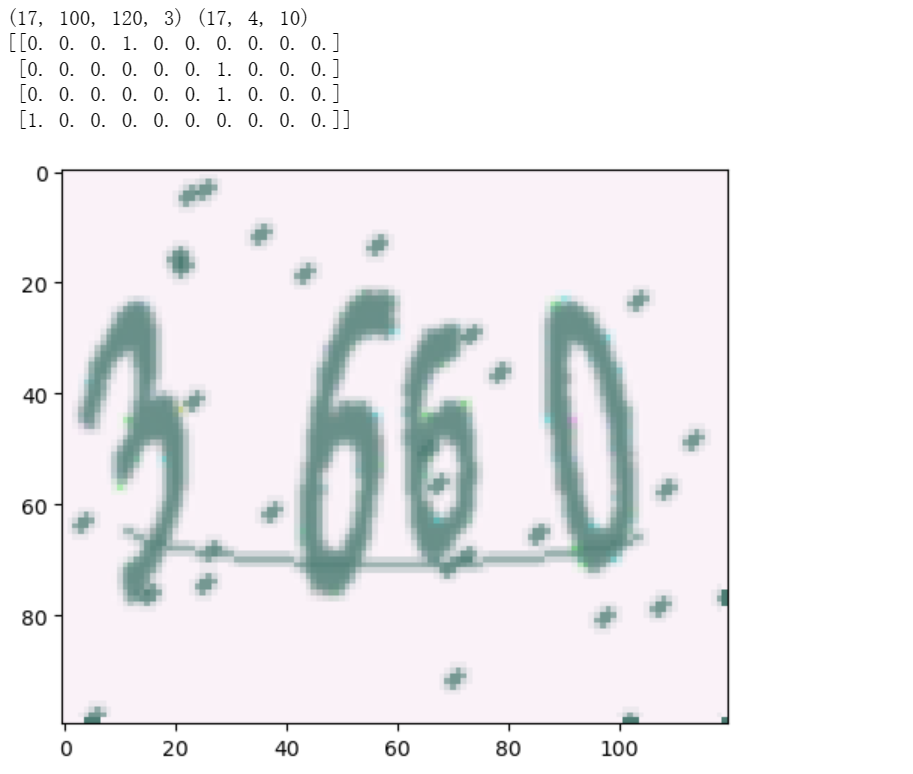
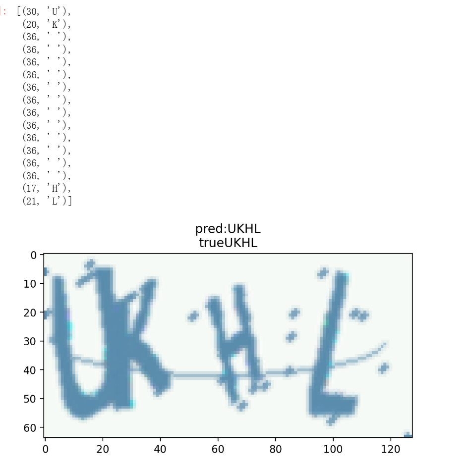

## 实验4-基于LSTM+CTC的验证码

### 1、实验目的

* 会利用循环网络模型解决序列数据的相关问题

### 2、实验内容

* 使用循环网络，自主实现效验码中多个数字字符的识别，并使用深度学习框架完成模型的训练

### 3、实验步骤

> 实验一共分为两个实践，第一个实践是CAPTCHA识别实践，第二个实践是基于LSTM+CTC的验证码识别是实践，本次实验第一个实践在CPU上完成，第二个实践则在GPU上完成

#### 3.1 CAPTCHA识别实践

* 获取数据集

  > tqdm用于显示进度条，captcha用于生成验证码数据集，一共生成100000个验证码图片

  ```python
  # 获取数据集
  from captcha.image import ImageCaptcha
  from tqdm import tqdm
  import random
  import os
  
  H, W, C = 100, 120, 3
  N_LABELS = 10
  D = 4
  
  def generate_captcha_images(datasets_path, num_images, width=200, height=100):
      images_path = os.path.join(datasets_path, 'image')
      if not os.path.exists(images_path):
          os.makedirs(images_path)
          
      label_file =  open(os.path.join(datasets_path, 'labels.txt'), 'w')
      image = ImageCaptcha(width=width, height=height)
      alphabet = '0123456789'
      for i in tqdm(range(num_images)):
          # 生成随机4位数字的效验码内容
          captcha_text = random.choices(alphabet, k=4)
          label = ''.join(captcha_text)
          # 文件名与输出路径
          image_filename = f'%d.' % i + 'jpg'
          output_path = os.path.join(images_path, image_filename)
          # 保存图片和写入标签
          image.write(label, output_path)
          label_file.write(image_filename + ',' + label + '\n')
      label_file.close()
  ```

  ```python
  # 生成以后将改行设为注释
  # generate_captcha_images('train1', 100000, width=120, height=100)
  ```

  

* 获取图片对应的标签值

  ```python
  # 获取图片对应的标签值
  import numpy as np
  import pandas as pd
  import os
  
  filenames_file = os.listdir('train1/image/')
  label_file = open('train1/labels.txt')
  
  filenames = []
  labels = []
  
  for line in label_file:
      line_split = line.strip().split(',')
      filename, label = line_split[0], line_split[1]
      filenames.append(filename)
      labels.append(label)
      
  # 将文件名和标签一一对应
  df = pd.DataFrame({
      'filename':filenames,
      'label':labels
  })
  
  df.head(1)
  ```

  

* 划分训练集和测试集

  > 按照8训练集：2训练集的比例进行划分

  ````python
  # 划分数据集
  from sklearn.model_selection import train_test_split
  
  df_train, df_valid = train_test_split(df, test_size=0.2, random_state=42)
  df_train = df_train.reset_index(drop=True)
  df_valid = df_valid.reset_index(drop=True)
  
  total_train = df_train.shape[0]
  total_valid = df_valid.shape[0]
  ````

* 构造data_generator

  ```python
  # 构造data_generator
  from tensorflow.keras.utils import to_categorical
  from PIL import Image
  
  def get_data_generator(df, num, for_training, batch_size=16):
      images, labels = [], []
      while True:
          for i in range(num):
              r = df.iloc[i]
              file, label = os.path.join('train1', 'image', r['filename']), r['label']
              im = Image.open(file)
              im = np.array(im) / 255.0
              images.append(np.array(im))
              labels.append(np.array([np.array(to_categorical(int(i), N_LABELS)) for i in label]))
              if len(images) > batch_size:
                  yield np.array(images), np.array(labels)
                  images, labels = [], []
              if not for_training:
                  break
  ```

* 查看所生成的数据样例

  ```python
  # 查看生成数据样例
  from matplotlib import pyplot as plt
  
  for v in get_data_generator(df_train, total_train, True):
      X, y = v
      break
  print(X.shape, y.shape)
  plt.imshow(X[0], interpolation='nearest')
  print(y[0])
  ```

  

  ```python
  batch_size = 64
  valid_batch_size = 64
  train_gen = get_data_generator(df_train, total_train, for_training=True, batch_size=batch_size)
  valid_gen = get_data_generator(df_valid, total_valid, for_training=True, batch_size=valid_batch_size)
  ```

* 构建网络，定义损失函数

  ```python
  # 构建网络
  import tensorflow as tf
  from tensorflow.keras import Sequential
  from tensorflow.keras import Input
  from tensorflow.keras.layers import Conv2D, PReLU, MaxPooling2D, Flatten, Dense, Reshape, Softmax
  
  model = Sequential()
  
  model.add(Input(shape=(H, W, C)))
  model.add(Conv2D(32, (3, 3)))
  model.add(PReLU())
  model.add(MaxPooling2D((2, 2), strides=2))
  
  model.add(Conv2D(64, (5, 5)))
  model.add(PReLU())
  model.add(MaxPooling2D((2, 2), strides=2))
  
  model.add(Conv2D(128, (5, 5,)))
  model.add(PReLU())
  model.add(MaxPooling2D((2, 2), strides=2))
  
  model.add(Flatten())
  model.add(Dense(D * N_LABELS))
  model.add(Reshape([D, N_LABELS]))
  
  model.add(Softmax())
  
  model.compile(optimizer='Adam', metrics=['accuracy'], loss='categorical_crossentropy')
  ```

* 查看网络结构

  ```python
  model.summary()
  ```

  

* 开始训练

  > 一共完成5个epoches，每个epoches含有1250步

  ```python
  histort = model.fit(train_gen,
                     steps_per_epoch=total_train//batch_size,
                     epochs=5,
                     validation_data=valid_gen,
                     validation_steps=total_valid//valid_batch_size)
  ```

  

* 测试验证

  ```python
  test = get_data_generator(df_valid, total_valid, True)
  X_test, y_test = next(test)
  
  plt.imshow(X_test[0], interpolation='nearest')
  print(y[0])
  
  y_pred = model.predict_on_batch(X_test)
  y_true = tf.math.argmax(y_test, axis=-1)
  y_pred = tf.math.argmax(y_pred, axis=-1)
  print('y_true:', y_true[0].numpy())
  print('y_pred:', y_pred[0].numpy())
  ```

  

#### 3.2 基于LSTM+CTC的验证码识别

* 导入相关库函数，定义常量

  ```python
  # 导入必要的库
  from captcha.image import ImageCaptcha
  from matplotlib import pyplot as plt
  import numpy as np
  import pandas as pd
  import random
  import tensorflow as tf
  import tensorflow.keras.backend as K
  import string
  
  %matplotlib inline
  %config InlineBackend.figure_format = 'retina'
  
  characters = string.digits + string.ascii_uppercase
  print(characters)
  
  width = 128
  height = 64
  n_len = 4
  n_class = len(characters) + 1
  ```

* 定义CTC损失函数

  ```python
  # 定义CTC Loss
  def ctc_lambda_func(args):
      y_pred, labels, input_length, label_length = args
      return K.ctc_batch_cost(labels, y_pred, input_length, label_length)
  ```

* 定义网络结构

  ```python
  input_tensor = Input((height, width, 3))
  x = input_tensor
  for i, n_cnn in enumerate([2, 2, 2, 2, 2]):
      for j in range(n_cnn):
          x = Conv2D(32*2**min(i, 3), kernel_size=3, padding='same', kernel_initializer='he_uniform')(x)
          x = BatchNormalization()(x)
          x = Activation('relu')(x)
      x = MaxPooling2D(2 if i < 3 else (2, 1))(x)
  x = Permute((2, 1, 3))(x)
  x = TimeDistributed(Flatten())(x)
  
  rnn_size = 128
  x = Bidirectional(GRU(rnn_size, return_sequences=True))(x)
  x = Bidirectional(GRU(rnn_size, return_sequences=True))(x)
  x = Dense(n_class, activation='softmax')(x)
  
  base_model = Model(inputs=input_tensor, outputs=x)
  ```

  ```python
  labels = Input(name='the_labels', shape=[n_len], dtype='float32')
  input_length = Input(name='input_length', shape=[1], dtype='int64')
  label_length = Input(name='label_length', shape=[1], dtype='int64')
  loss_out = Lambda(ctc_lambda_func, output_shape=(1,), name='ctc')([x, labels, input_length, label_length])
  
  model = Model(inputs=[input_tensor, labels, input_length, label_length], outputs=loss_out)
  ```

* 生成数据

  ```python
  # 数据生成
  from tensorflow.keras.utils import Sequence
  
  class CaptchaSequence(Sequence):
      def __init__(self, characters, batch_size, steps, n_len=4, width=128, height=64,
                   input_length=16, label_length=4):
          self.characters = characters
          self.batch_size = batch_size
          self.steps = steps
          self.n_len = n_len
          self.width = width
          self.height = height
          self.input_length = input_length
          self.label_length = label_length
          self.n_class = len(characters)
          self.generator = ImageCaptcha(width=width, height=height)
      
      def __len__(self):
          return self.steps
      
      def __getitem__(self, idx):
          X = np.zeros((self.batch_size, self.height, self.width, 3), dtype=np.float32)
          y = np.zeros((self.batch_size, self.n_len), dtype=np.uint8)
          input_length = np.ones(self.batch_size)*self.input_length
          label_length = np.ones(self.batch_size)*self.label_length
          for i in range(self.batch_size):
              rand_str = ''.join([random.choice(self.characters) for j in range(self.n_len)])
              X[i] = np.array(self.generator.generate_image(rand_str))/255.0
              y[i] = [self.characters.find(x) for x in rand_str]
          return [X, y, input_length, label_length], np.ones(self.batch_size)
  ```

  ```python
  # 查看生成的图片
  data = CaptchaSequence(characters, batch_size=1, steps=1)
  [X_test, y_test, _, _], _ = data[0]
  plt.imshow(X_test[0])
  plt.title(''.join([characters[x] for x in y_test[0]]))
  print(input_length, label_length)
  ```

  

* 准确率回调

  ```python
  # 准确率回调函数
  from tqdm import tqdm
  def evaluate(model, batch_size=128, steps=20):
      batch_acc = 0
      valid_data = CaptchaSequence(characters, batch_size, steps)
      for [X_test, y_test, _, _], _ in valid_data:
          y_pred = base_model.predict(X_test)
          shape = y_pred.shape
          out = K.get_value(K.ctc_decode(y_pred, input_length=np.ones(shape[0])*shape[1])[0][0])[:, :4]
          if out.shape[1] == 4:
              batch_acc += (y_test == out).all(axis=1).mean()
              
      return batch_acc / steps
      
  from tensorflow.keras.callbacks import Callback
  
  class Evaluate(Callback):
      def __init__(self):
          self.accs = []
          
      def on_epoch_end(self, epoch, logs=None):
          logs = logs or {}
          acc = evaluate(base_model)
          logs['val_acc'] = acc
          self.accs.append(acc)
          print(f'\nacc:{acc*100:.4f}')
  ```

* 训练模型

  > 由于使用了EarlyStopping，当训练到第13个epoch时，损失值的减少已经小于1e-3，所以会提前停止训练

  ```python
  # 模型训练
  from tensorflow.keras.callbacks import EarlyStopping, CSVLogger, ModelCheckpoint
  from tensorflow.keras.optimizers import *
  
  train_data = CaptchaSequence(characters, batch_size=128, steps=1000)
  valid_data = CaptchaSequence(characters, batch_size=128, steps=100)
  
  callbacks = [EarlyStopping(patience=5), Evaluate(),
               CSVLogger('ctc.csv'), ModelCheckpoint('ctc_best.h5', save_best_only=True)]
  
  model.compile(loss={'ctc': lambda y_true, y_pred: y_pred}, optimizer=Adam(1e-3, amsgrad=True))
  
  # 查看GPU设备
  tf.config.experimental.list_physical_devices('GPU')
  
  with tf.device('GPU:0'):
      model.fit(train_data, epochs=100, validation_data=valid_data, workers=4,
                callbacks=callbacks)
  ```

  

* 提高精度，再次训练

  > 这一次在第24epoch时停止了训练

  ```python
  # 提前停止了，继续载入参数训练一会
  model.load_weights('ctc_best.h5')
  
  callbacks = [EarlyStopping(patience=5), Evaluate(),
               CSVLogger('ctc.csv', append=True), ModelCheckpoint('ctc_best.h5', save_best_only=True)]
  
  model.compile(loss={'ctc': lambda y_true, y_pred: y_pred}, optimizer=Adam(1e-4, amsgrad=True))
  
  with tf.device('GPU:0'):
      model.fit(train_data, epochs=100, validation_data=valid_data, workers=4,
                callbacks=callbacks)
  ```

  

* 模型测试

  ```python
  # 模型测试
  model.load_weights('ctc_best.h5')
  characters2 = characters + ' '
  [X_test, y_test, _, _], _ = data[0]
  y_pred = base_model.predict(X_test)
  out = K.get_value(K.ctc_decode(y_pred, input_length=np.ones(y_pred.shape[0])*y_pred.shape[1], )[0][0])[:, :4]
  out = ''.join([characters[x] for x in out[0]])
  y_true = ''.join([characters[x] for x in y_test[0]])
  
  plt.imshow(X_test[0])
  plt.title('pred:' + str(out) + '\ntrue' + str(y_true))
  
  argmax = np.argmax(y_pred, axis=2)[0]
  list(zip(argmax, ''.join([characters2[x] for x in argmax])))
  ```

  

* 计算总体准确度

  ```python
  # 计算模型总体准确度
  evaluate(base_model)
  ```

  

* 保存模型

  ```python
  # 保存模型
  base_model.save('ctc.h5', include_optimizer=False)
  ```

* 可视化训练曲线

  ```python
  # 可视化训练曲线
  df = pd.read_csv('ctc.csv')
  df[['loss', 'val_loss']].plot()
  ```

  

### 4、总结

* 对LSTM的理解

  Long Short Term Memory networks（以下简称LSTMs），一种特殊的RNN网络，该网络设计出来是为了解决长依赖问题。

  所有循环神经网络都具有神经网络的重复模块链的形式。 在标准的RNN中，该重复模块将具有非常简单的结构，例如单个tanh层。

  

  LSTMs也具有这种链式结构，但是它的重复单元不同于标准RNN网络里的单元只有一个网络层，它的内部有四个网络层。

  

* 对CTC的理解

  CTC（Connectionist Temporal Classifier，联接时间分类器），主要用于解决输入特征与输出标签的对齐问题。由于文字的不同间隔或变形等问题，导致同个文字有不同的表现形式，但实际上都是同一个文字。在识别时会将输入图像分块后再去识别，得出每块属于某个字符的概率（无法识别的标记为特殊字符”-”）。由于字符变形等原因，导致对输入图像分块识别时，相邻块可能会识别为同个结果，字符重复出现。因此，通过CTC来解决对齐问题，模型训练后，对结果中去掉间隔字符、去掉重复字符（如果同个字符连续出现，则表示只有1个字符，如果中间有间隔字符，则表示该字符出现多次。

* 实验所涉及的问题

  * 问题1：两个实验运用的模型有什么差别？

    第一个实验的模型单纯的运用了卷积神经网络，而第二个实验的模型还用到了LSTM+CTC的机制。

  * 问题2：第二个实验运用的模型更适合哪一类任务？

    第二个实验更适合解决对于序列任务的识别，特征之间有依赖关系的这一类任务。

  * 问题3：LSTM为什么能够适用于这一类任务？

    LSTM网络能通过一种被称为门的结构对细胞状态进行删除或者添加信息。门能够有选择性的决定让哪些信息通过，包含记忆门：决定给细胞状态添加哪些新的信息，遗忘门：选择忘记旧细胞信息的一部分，输出门：决定最终的输出。

  * 问题4：对CTC的理解，CTC有什么作用？

    主要用于解决输入特征与输出标签的对齐问题，在本次实验中，图片识别过程中，会将一些无关的特征识别成空白，同时对输出标签进行定长后再提取最终信息。

