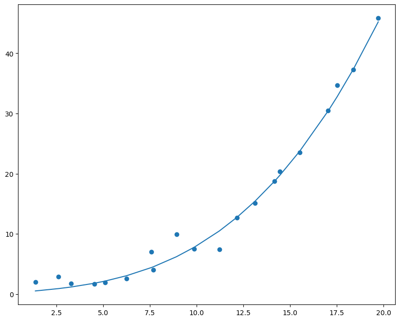
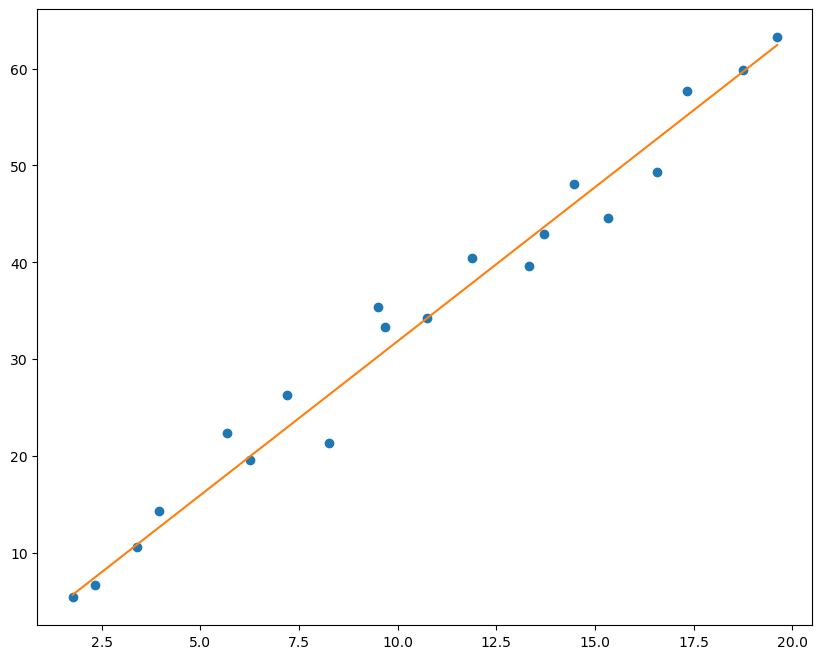
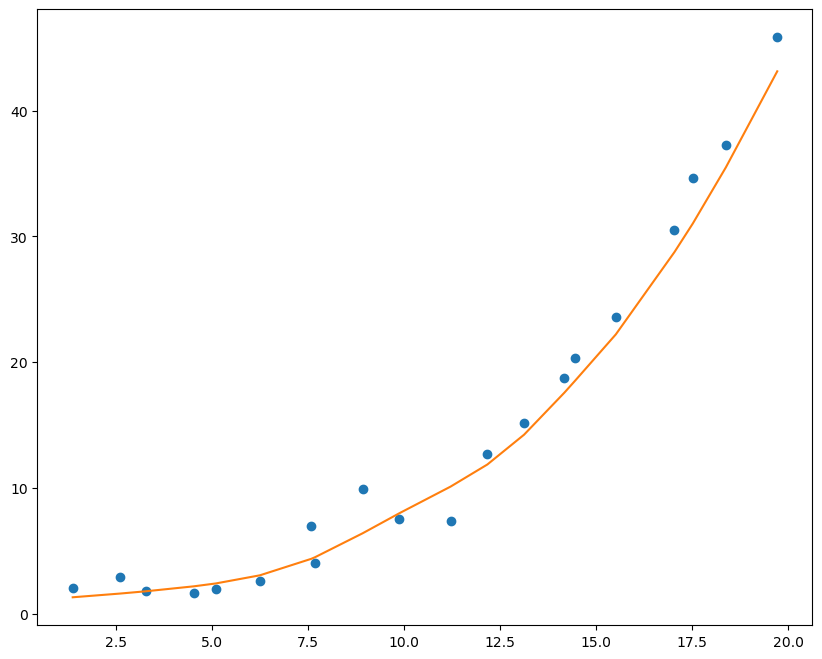

# 实验一、线性回归

* 已知模型y = a*x + b
* 生成带噪声的数据拟合线性函数
* 绘制图像拟合效果


```python
# 导入相关包
import torch
import numpy as np
%matplotlib inline
from matplotlib import pyplot as plt
```


```python
# 生成y = a*x + b的噪声数据200个
# 定义a = 3， b = 2
a, b = 3, 2

x_datas = torch.linspace(1,20,200)
rand_noise = torch.randn(200)*3
y_lables = a*x_datas + b + rand_noise
```


```python
# 绘制散点图
plt.figure(figsize=(10, 8))
plt.scatter(x_datas, y_lables)
plt.show()
```


​    

​    


```python
# 将数据划分为训练集和测试集，按照180，20进行划分
# 每十个数据中，分层抽取出一个数据作为测试集

test_index = [10*i + np.random.randint(10) for i in range(20)]
train_index = [i for i in range(200) if i not in test_index]

X_train1, X_test1, y_train1, y_test1 = x_datas[train_index], x_datas[test_index], y_lables[train_index], y_lables[test_index]
y_train1
```


    tensor([ 3.6945,  4.7438,  7.9504,  5.5705,  5.6000,  9.5666,  8.5461,  4.9789,
             0.6976,  5.6866,  4.2295, 10.9321, 11.2976,  7.9842, 12.1275,  8.0943,
            10.5445, 13.4849, 18.5069, 11.6880, 16.8814, 12.7575, 10.7111, 12.1603,
            14.7055, 14.3254, 11.4367, 17.6528, 18.5793, 17.8409, 13.8733, 16.6622,
            18.6143, 14.5482, 16.6509, 17.4552, 20.0250, 20.3924, 20.6348, 18.2929,
            16.6831, 20.4449, 17.3773, 18.3895, 18.2360, 24.1661, 18.2511, 16.6143,
            20.3642, 16.5544, 19.0061, 25.6141, 20.1254, 21.4796, 23.3279, 20.1736,
            25.3058, 26.7936, 24.8702, 23.0888, 24.2360, 26.3334, 26.8100, 22.9726,
            25.0721, 28.1969, 27.3128, 28.3941, 27.2811, 25.5293, 29.3596, 30.8378,
            29.3787, 30.2246, 28.6970, 19.3994, 31.6431, 35.1937, 26.6844, 31.5928,
            32.8604, 31.2751, 26.1607, 26.1867, 27.4753, 28.5589, 32.5150, 35.3546,
            29.3716, 30.2867, 34.1565, 36.8429, 32.5876, 41.2268, 32.7979, 35.0479,
            38.0979, 34.0405, 35.0074, 40.8656, 39.9885, 37.4418, 37.3445, 33.4271,
            40.4349, 41.4754, 36.4292, 41.2385, 41.1300, 39.4304, 39.1217, 40.2641,
            41.4882, 36.4677, 45.3880, 41.7064, 46.0084, 42.7886, 48.2276, 48.9552,
            45.7761, 46.6802, 49.1144, 47.0020, 41.9040, 47.4266, 48.3905, 51.4273,
            46.7154, 49.9467, 45.0021, 50.9472, 55.9469, 49.3655, 44.3413, 47.9426,
            45.9358, 54.3920, 49.9636, 53.2459, 50.3228, 46.5756, 50.2442, 54.3946,
            50.2086, 49.6290, 50.5312, 54.7947, 47.7757, 50.7428, 52.6791, 55.2901,
            55.9978, 57.0760, 50.6741, 53.8824, 58.6424, 53.3195, 57.1432, 54.2989,
            49.9915, 55.4631, 56.1260, 55.4143, 54.0111, 56.7517, 59.6828, 57.2633,
            56.1236, 63.1750, 59.2744, 54.7133, 54.5091, 57.9472, 64.0721, 63.9801,
            61.2980, 61.6411, 62.6100, 59.2035])


```python
# 将训练集转化为张量，使用梯度下降法进行训练
# 迭代次数 10000，学习率：0.001

a = torch.rand(1, requires_grad=True)
b = torch.rand(1, requires_grad=True)
loss = []
theta = 0.00001

for i in range(10000+1):
    y_p = a.expand_as(X_train1)*X_train1 + b.expand_as(X_train1)
    loss_tmp = torch.mean((y_p - y_train1)**2)
    if i%500 == 0:
        print("迭代" , i , "次，损失值为：",loss_tmp.data.numpy())
    
    loss.append(loss_tmp.data.numpy())
    loss_tmp.backward()
    a.data = a.data - theta*a.grad.data
    b.data = b.data - theta*b.grad.data
    a.grad.data.zero_()
    b.grad.data.zero_()
    
print(a, b)
```

    迭代 0 次，损失值为： 1019.3526
    迭代 500 次，损失值为： 68.77335
    迭代 1000 次，损失值为： 12.962891
    迭代 1500 次，损失值为： 9.682995
    迭代 2000 次，损失值为： 9.4870615
    迭代 2500 次，损失值为： 9.47218
    迭代 3000 次，损失值为： 9.467946
    迭代 3500 次，损失值为： 9.46435
    迭代 4000 次，损失值为： 9.460806
    迭代 4500 次，损失值为： 9.457279
    迭代 5000 次，损失值为： 9.453774
    迭代 5500 次，损失值为： 9.450276
    迭代 6000 次，损失值为： 9.446788
    迭代 6500 次，损失值为： 9.44333
    迭代 7000 次，损失值为： 9.439879
    迭代 7500 次，损失值为： 9.436436
    迭代 8000 次，损失值为： 9.433018
    迭代 8500 次，损失值为： 9.429613
    迭代 9000 次，损失值为： 9.426218
    迭代 9500 次，损失值为： 9.422838
    迭代 10000 次，损失值为： 9.419481
    tensor([3.1121], requires_grad=True) tensor([0.9682], requires_grad=True)


```python
plt.figure(figsize=(10, 8))
plt.scatter(X_test1, y_test1)

plt.plot(X_test1.data.numpy(), a.data.numpy()*X_test1.data.numpy() + b.data.numpy())

plt.show()
```


    


* 已知模型y = a*x^3 + b*x^2 + c*x + d
* 生成带噪声的数据拟合三次函数
* 绘制图像拟合效果


```python
# 生成200个噪声数据
# 参数设置，a=0.005, b=0.01, c=0.1, d=1

a, b, c, d = 0.005, 0.01, 0.1, 1

rand = torch.randn(200)*1.5
X_trains = torch.linspace(1, 20, 200)
Y_labels = a*(X_trains**3) + b*(X_trains**2) + c*X_trains + d + rand

plt.figure(figsize=(10, 8))
plt.scatter(X_trains, Y_labels)
plt.show()
```


​    

​    


```python
# 构造数据集和训练集标签

test_index = [10*i + np.random.randint(10) for i in range(20)]
train_index = [i for i in range(200) if i not in test_index]

X_train2, X_test2, y_train2, y_test2 = X_trains[train_index], X_trains[test_index], Y_labels[train_index], Y_labels[test_index]
```


```python
# 开始训练
a = torch.rand(1, requires_grad=True)
b = torch.rand(1, requires_grad=True)
c = torch.rand(1, requires_grad=True)
d = torch.rand(1, requires_grad=True)
theta = 0.0000001
times = 50000
loss = []

for i in range(times+1):
    loss_tmp = torch.mean(((a.expand_as(X_train2) * (X_train2**3) + 
                           b.expand_as(X_train2) * (X_train2**2) + c.expand_as(X_train2) * X_train2 + 
                           d.expand_as(X_train2) - y_train2))**2)
    if i%2500 == 0:
        print("迭代", i,"次，损失值为：", loss_tmp.data.numpy())
    
    loss_tmp.backward()
    a.data = a.data - a.grad.data * theta
    b.data = b.data - b.grad.data * theta
    c.data = c.data - c.grad.data * theta
    d.data = d.data - d.grad.data * theta
    
    a.grad.data.zero_()
    b.grad.data.zero_()
    c.grad.data.zero_()
    d.grad.data.zero_()
    
```

    迭代 0 次，损失值为： 3153.991
    迭代 2500 次，损失值为： 11.566195
    迭代 5000 次，损失值为： 5.8502893
    迭代 7500 次，损失值为： 3.6634474
    迭代 10000 次，损失值为： 2.8267233
    迭代 12500 次，损失值为： 2.506517
    迭代 15000 次，损失值为： 2.3839154
    迭代 17500 次，损失值为： 2.3369095
    迭代 20000 次，损失值为： 2.318825
    迭代 22500 次，损失值为： 2.3118067
    迭代 25000 次，损失值为： 2.3090246
    迭代 27500 次，损失值为： 2.307857
    迭代 30000 次，损失值为： 2.307303
    迭代 32500 次，损失值为： 2.3069975
    迭代 35000 次，损失值为： 2.3067696
    迭代 37500 次，损失值为： 2.306577
    迭代 40000 次，损失值为： 2.3063998
    迭代 42500 次，损失值为： 2.3062305
    迭代 45000 次，损失值为： 2.3060641
    迭代 47500 次，损失值为： 2.3058996
    迭代 50000 次，损失值为： 2.3057368


```python
# 对测试集进行预测拟合
plt.figure(figsize=(10, 8))
plt.scatter(X_test2, y_test2)

plt.plot(X_test2.data.numpy(), a.data.numpy()*(X_test2.data.numpy()**3) + b.data.numpy()*(X_test2.data.numpy()**2) + c.data.numpy()*X_test2.data.numpy() + d.data.numpy())

plt.show()
```


​    

​    


##  设计神经网络对前面的数据进行拟合

* 记录误差，绘制拟合效果
* 直线拟合数据为：X_train1, y_train1, X_test1, y_test1
* 曲线拟合数据为：X_train2, y_train2, X_test2, y_test2

### 一、拟合直线


```python
# 使用网络拟合直线
# 直线拟合只需要一个神经元就能完成拟合

# 定义网络
net = torch.nn.Sequential(
    torch.nn.Linear(1,1),
)
# 定义损失函数
loss_fn = torch.nn.MSELoss()
# 梯度下降方法，随机梯度下降
opt = torch.optim.SGD(net.parameters(), lr=0.0001)
```


```python
# 训练数据
losses = []
for i in range(1000):
    pred = net(X_train1.view(-1,1))
    loss = loss_fn(pred, y_train1.view(-1,1))
    if i%200==0:
        print('loss:', loss.data)
        losses.append(loss.data)
    
    opt.zero_grad()
    loss.backward()
    opt.step()
    
plt.figure(figsize=(10, 8))
plt.plot(X_train1.data.numpy(), y_train1.data.numpy(), 'o')
plt.plot(X_train1.data.numpy(), net(X_train1.view(-1,1)).data.numpy())
plt.show()
```

    loss: tensor(999.4984)
    loss: tensor(10.4790)
    loss: tensor(10.4377)
    loss: tensor(10.4070)
    loss: tensor(10.3768)


    


```python
# 对测试集进行预测验证
pred = net(X_test1.view(-1,1))
plt.figure(figsize=(10, 8))
plt.plot(X_test1.data.numpy(), y_test1.data.numpy(), 'o')
plt.plot(X_test1.data.numpy(), pred.data.numpy())
plt.show()
```


​    

​    


### 二、拟合多项式函数

* 单层神经网络只能够拟合直线
* 对多项式函数的拟合需要多层神经网络，且需要激活函数


```python
# 定义model类
import torch.nn as nn
import torch.nn.functional as F

# 继承nn.Module
class model(nn.Module):
    def __init__(self):
        super().__init__()
        # 第一个隐藏层
        self.hidden1=nn.Linear(1,4)
        # 第二个隐藏层
        self.hidden2=nn.Linear(4,4)
        # 第三个隐藏层
        self.hidden3=nn.Linear(4,4)
        # 输出层
        self.out=nn.Linear(4,1)
    
    # 定义网络前向运算
    def forward(self, x):
        x = self.hidden1(x)
        x = F.sigmoid(x)
        x = self.hidden2(x)
        x = F.sigmoid(x)
        x = self.hidden3(x)
        x = F.sigmoid(x)
        x = self.out(x)
        return x
    
net = model()
print(net)
```

    model(
      (hidden1): Linear(in_features=1, out_features=4, bias=True)
      (hidden2): Linear(in_features=4, out_features=4, bias=True)
      (hidden3): Linear(in_features=4, out_features=4, bias=True)
      (out): Linear(in_features=4, out_features=1, bias=True)
    )


```python
# 定义损失函数
loss_fn = torch.nn.MSELoss()
opt = torch.optim.SGD(net.parameters(), lr=0.001)
```


```python
# 训练数据
losses2 = []
for i in range(50000):
    pred = net(X_train2.view(-1,1))
    loss = loss_fn(pred, y_train2.view(-1,1))
    if i%2500==0:
        print('loss:', loss.data)
        losses2.append(loss)
    
    opt.zero_grad()
    loss.backward()
    opt.step()

# 绘制图像
plt.figure(figsize=(10, 8))
plt.plot(X_train2.data.numpy(), y_train2.data.numpy(), 'o')
plt.plot(X_train2.data.numpy(), net(X_train2.view(-1,1)).data.numpy())
plt.show()
```

    loss: tensor(357.9143)


    D:\02_soft\anaconda3\envs\pytorch\lib\site-packages\torch\nn\functional.py:1960: UserWarning: nn.functional.sigmoid is deprecated. Use torch.sigmoid instead.
      warnings.warn("nn.functional.sigmoid is deprecated. Use torch.sigmoid instead.")


    loss: tensor(146.0952)
    loss: tensor(23.4380)
    loss: tensor(16.6693)
    loss: tensor(12.3312)
    loss: tensor(10.4051)
    loss: tensor(8.9617)
    loss: tensor(7.7465)
    loss: tensor(6.7640)
    loss: tensor(5.9918)
    loss: tensor(5.4033)
    loss: tensor(4.9512)
    loss: tensor(4.5902)
    loss: tensor(4.2906)
    loss: tensor(4.0353)
    loss: tensor(3.8134)
    loss: tensor(3.6182)
    loss: tensor(3.4456)
    loss: tensor(3.2944)
    loss: tensor(3.1646)


    


```python
# 使用训练的模型对测试集进行预测
pred2 = net(X_test2.view(-1,1))
plt.figure(figsize=(10, 8))
plt.plot(X_test2.data.numpy(), y_test2.data.numpy(), 'o')
plt.plot(X_test2.data.numpy(), pred2.data.numpy())
plt.show()
```



    

