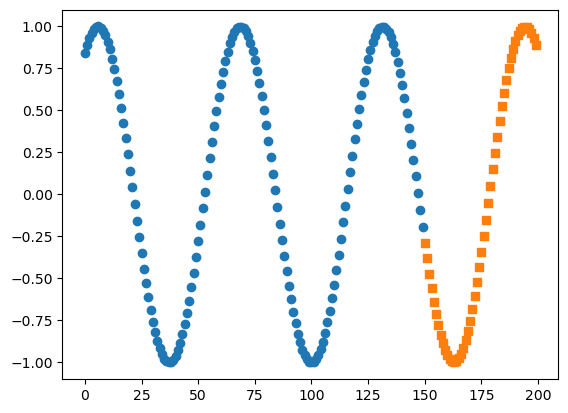

# 实验5：LSTM与迁移学习

### 1、序列预测

已知一个整数序列的通项公式（自行选择），根据公式生成若干长度为5的序列做为训练集，训练一个LSTM网络，对给定的序列预测下一项的值。

**完成程度：**使用函数3*x+2生成100个长度为5的序列，选择前4列作为特征，第5列作为标签，按照9训练集：1测试集对生成的数据进行划分，定义LSTM网络，包含1个LSTM和一个全连接层。使用训练集对模型进行训练，在验证集上进行验证测试。

### 2、正弦函数预测

通过已知的样本数据对正弦函数进行预测，并绘制成图形。要求分别设计LSTM，GRU和RNN网络进行预测，记录三者的预测准确率并绘制图形

**完成程度：**使用正弦函数生成200个长度为10的序列，选择前9列作为特征，第10列作为标签，按照3训练集：1测试集对生成的数据进行划分，分别定义RNN、LSTM、GRU网络，定义一个全连接层。分别使用三个模型在训练集上对模型进行训练，在测试集上进行验证测试。

### 3、猫狗大战

通过来自kaggle上的猫狗数据集，训练一个识别猫狗图片的分类器。要求设计一个使用ResNet18作为主干的卷积神经网络，在迁移网络时采用固定值模式，要求模型的准确率不低于90%。猫狗大战数据集训练集有25000张，猫狗各占一办。测试集12500张。

**完成程度：**对训练数据进行划分，划分为训练集和测试集，其中训练集包含11250张图片，测试集包含1250张图片，随机取出一张图片查看样本图片。利用ResNet50作为基干网，定义网络模型，修改ResNet50的最后一层全连接层，再使用addmodule添加一个dropout和一个全连接层，使用交叉熵损失函数，并将模型和损失函数放入GPU中对模型开始进行训练，一共训练5个epoch，在测试集上进行测试验证，模型准确率为95.16%。

## 1、序列预测


```python
import torch
import torch.nn as nn
import torch.nn.functional as F
from torch.utils.data import Dataset, DataLoader, TensorDataset
import numpy as np
import pandas as pd
from matplotlib import pyplot as plt
```


```python
# 生成序列
def getSeq(start, n):
    x = [ 3*x+2 for x in range(start, start+n)]
    return x

data = []
for i in range(100):
    rnd = np.random.randint(0, 25)
    data.append(getSeq(rnd, 5))
    
data = np.array(data)
data = torch.from_numpy(data)

```


```python
target = data[:, -1:].type(torch.FloatTensor)
data = data[:, :-1].type(torch.FloatTensor)

train_x = data[:90]
train_y = target[:90]
test_x = data[90:]
test_y = target[90:]

train_dataset = TensorDataset(train_x, train_y)
test_dataset = TensorDataset(test_x, test_y)
train_loader = DataLoader(dataset=train_dataset, batch_size=5, shuffle=True)
test_loader = DataLoader(dataset=test_dataset, batch_size=5, shuffle=True)
```


```python
# 构建LSTM网络
class model(nn.Module):
    def __init__(self):
        super().__init__()
        self.lstm = nn.LSTM(1, 10, batch_first=True)
        self.fc = nn.Linear(10, 1)
        
    def forward(self, x, hidden):
        # print(hidden)
        output, hidden = self.lstm(x, hidden)
        output = output[:, -1, :]
        output = self.fc(output)
        return output
    
net = model()
loss_fn = nn.MSELoss()
opt = torch.optim.Adam(net.parameters(), lr=0.001)
```


```python
# 训练
# 初始化h0，c0，如果batchsize不是4，要考虑最后一个batch的样本数
h0 = torch.zeros(1, 5, 10)
c0 = torch.zeros(1, 5, 10)

for epoch in range(1200):
    for i, data in enumerate(train_loader):
        x, y = data
        #print(x)
        x = x.view(-1, 4, 1)
        # print(x.shape,h0.shape)
        
        pred = net(x, (h0, c0))
        loss = loss_fn(pred, y)
        
        opt.zero_grad()
        loss.backward()
        opt.step()
        
    if epoch%100==0:
        print('第',epoch,'epoch，损失为：',loss.data)
```

    第 0 epoch，损失为： tensor(2489.9465)
    第 100 epoch，损失为： tensor(1262.1434)
    第 200 epoch，损失为： tensor(1057.6017)
    第 300 epoch，损失为： tensor(109.3138)
    第 400 epoch，损失为： tensor(167.9138)
    第 500 epoch，损失为： tensor(47.4988)
    第 600 epoch，损失为： tensor(0.7118)
    第 700 epoch，损失为： tensor(0.6654)
    第 800 epoch，损失为： tensor(0.0557)
    第 900 epoch，损失为： tensor(0.0901)
    第 1000 epoch，损失为： tensor(0.0679)
    第 1100 epoch，损失为： tensor(0.0544)


```python
# 测试验证
rights=0
length=0

for i, data in enumerate(test_loader):
    x, y = data
    x = x.view(-1, 4, 1)
    hidden = torch.zeros(1, 5, 10)
    pred = net(x, (h0, c0))
    print(y.view(1, -1).data)
    print(pred.view(1, -1).data)
```

    tensor([[17., 38., 83., 17., 53.]])
    tensor([[16.9066, 37.6783, 82.5042, 16.9066, 52.4514]])
    tensor([[29., 41., 86., 50., 86.]])
    tensor([[28.9673, 40.6793, 85.1809, 49.4299, 85.1809]])

## 2、正弦函数预测


```python
import torch
import torch.nn as nn
import torch.nn.functional as F
from torch.utils.data import Dataset, DataLoader, TensorDataset
import numpy as np
import pandas as pd
from matplotlib import pyplot as plt
```


```python
data = []
start = 0
for i in range(200):
    x = [np.sin(x/10) for x in range(start, start+11)]
    data.append(x)
    start = start+1

data = np.array(data)
data = torch.from_numpy(data)

target = data[:, -1:].type(torch.FloatTensor)
data = data[:, :-1].type(torch.FloatTensor)

train_x = data[:150]
train_y = target[:150]
test_x = data[150:]
test_y = target[150:]

train_dataset = TensorDataset(train_x, train_y)
test_dataset = TensorDataset(test_x, test_y)
train_loader = DataLoader(train_dataset, batch_size=5, shuffle=True)
test_loader = DataLoader(test_dataset, batch_size=5, shuffle=False)
```


```python
# 构建模型
# 构建LSTM网络
class model(nn.Module):
    def __init__(self):
        super().__init__()
        self.lstm = nn.LSTM(1, 10, batch_first=True)
        self.cnn = nn.RNN(1, 10, batch_first=True)
        self.gru = nn.GRU(1, 10, batch_first=True)
        self.fc = nn.Linear(10, 1)
        
    def forward(self, x, hidden):
        # print(hidden)
        #output, hidden = self.lstm(x, hidden)
        output, hidden = self.cnn(x, hidden)
        #output, hidden = self.gru(x, hidden)
        output = output[:, -1, :]
        output = self.fc(output)
        return output
    
net = model()
loss_fn = nn.MSELoss()
opt = torch.optim.Adam(net.parameters(), lr=0.001)
```


```python
# 训练
# 初始化h0，c0，如果batchsize不是4，要考虑最后一个batch的样本数
h0 = torch.zeros(1, 5, 10)
c0 = torch.zeros(1, 5, 10)

for epoch in range(500):
    for i, data in enumerate(train_loader):
        x, y = data
        #print(x)
        x = x.view(-1, 10, 1)
        # print(x.shape,h0.shape)
        
        pred = net(x, h0)
        loss = loss_fn(pred, y)
        
        opt.zero_grad()
        loss.backward()
        opt.step()
        
    if epoch%50==0:
        print('第',epoch,'epoch，损失为：',loss.data)
```

    第 0 epoch，损失为： tensor(0.2056)
    第 50 epoch，损失为： tensor(0.0008)
    第 100 epoch，损失为： tensor(2.5645e-05)
    第 150 epoch，损失为： tensor(9.5258e-06)
    第 200 epoch，损失为： tensor(1.8686e-05)
    第 250 epoch，损失为： tensor(4.9946e-05)
    第 300 epoch，损失为： tensor(3.0734e-06)
    第 350 epoch，损失为： tensor(1.7624e-06)
    第 400 epoch，损失为： tensor(2.9713e-06)
    第 450 epoch，损失为： tensor(5.6524e-06)


```python
# 测试验证
preds = []

for i, data in enumerate(test_loader):
    x, y = data
    x = x.view(-1, 10, 1)
    hidden = torch.zeros(1, 5, 10)
    pred = net(x, h0)
    preds.append(pred.data.numpy())
    print(y.view(1, -1).data)
    print(pred.view(1, -1).data, '\n')
    
plt.scatter(range(len(train_y)), train_y.data.numpy(), marker='o')
#plt.scatter(range(150, 200), test_y.data.numpy(), marker='o')

plt.scatter(range(150, 200), preds, marker='s')
plt.show()
```

    tensor([[-0.2879, -0.3821, -0.4724, -0.5581, -0.6381]])
    tensor([[-0.2867, -0.3812, -0.4718, -0.5576, -0.6377]]) 
    
    tensor([[-0.7118, -0.7784, -0.8371, -0.8876, -0.9291]])
    tensor([[-0.7111, -0.7773, -0.8356, -0.8855, -0.9265]]) 
    
    tensor([[-0.9614, -0.9841, -0.9969, -0.9998, -0.9927]])
    tensor([[-0.9584, -0.9809, -0.9939, -0.9973, -0.9909]]) 
    
    tensor([[-0.9756, -0.9488, -0.9126, -0.8672, -0.8132]])
    tensor([[-0.9747, -0.9488, -0.9133, -0.8683, -0.8143]]) 
    
    tensor([[-0.7510, -0.6813, -0.6048, -0.5223, -0.4346]])
    tensor([[-0.7518, -0.6815, -0.6044, -0.5214, -0.4336]]) 
    
    tensor([[-0.3425, -0.2470, -0.1490, -0.0495,  0.0504]])
    tensor([[-0.3417, -0.2467, -0.1494, -0.0504,  0.0495]]) 
    
    tensor([[0.1499, 0.2478, 0.3433, 0.4354, 0.5231]])
    tensor([[0.1492, 0.2477, 0.3438, 0.4363, 0.5242]]) 
    
    tensor([[0.6055, 0.6820, 0.7516, 0.8137, 0.8676]])
    tensor([[0.6065, 0.6826, 0.7518, 0.8134, 0.8670]]) 
    
    tensor([[0.9129, 0.9491, 0.9758, 0.9928, 0.9998]])
    tensor([[0.9120, 0.9480, 0.9746, 0.9915, 0.9987]]) 
    
    tensor([[0.9968, 0.9839, 0.9612, 0.9288, 0.8872]])
    tensor([[0.9960, 0.9834, 0.9610, 0.9289, 0.8875]]) 


​    


​    

​    

## 3、猫狗大战

```python
import os
import time

import torch
import torch.nn as nn
import torch.optim as opt
import torch.nn.functional as F
import torchvision
from torch.utils.data import DataLoader
from torchvision import datasets, models, transforms
import numpy as np
import matplotlib.pyplot as plt
import time
```


```python
import shutil

# kaggle原始数据集地址
original_dataset_dir = '/Users/jihaipeng/PycharmProjects/深度学习实践/深度学习实验/5实验5/dogs_cats/kaggle/train'
total_num = 12500  #int(len(os.listdir(original_dataset_dir)) / 2)
random_idx = np.array(range(total_num))
np.random.shuffle(random_idx)
# 待处理的数据集地址
base_dir = '/Users/jihaipeng/PycharmProjects/深度学习实践/深度学习实验/5实验5/dogs_cats/kaggle/data'
if not os.path.exists(base_dir):
    os.mkdir(base_dir)

# 训练集、测试集的划分
sub_dirs = ['train', 'test']
animals = ['cats', 'dogs']
train_idx = random_idx[:int(total_num * 0.9)]
test_idx = random_idx[int(total_num * 0.9):]
numbers = [train_idx, test_idx]
for idx, sub_dir in enumerate(sub_dirs):
    dir = os.path.join(base_dir, sub_dir)
    if not os.path.exists(dir):
        os.mkdir(dir)
    for animal in animals:
        animal_dir = os.path.join(dir, animal)  #
        if not os.path.exists(animal_dir):
            os.mkdir(animal_dir)
        fnames = [animal[:-1] + '.{}.jpg'.format(i) for i in numbers[idx]]
        for fname in fnames:
            src = os.path.join(original_dataset_dir, fname)
            dst = os.path.join(animal_dir, fname)
            shutil.copyfile(src, dst)

        # 验证训练集、验证集、测试集的划分的照片数目
        print(animal_dir + ' total images : %d' % (len(os.listdir(animal_dir))))
```

    /Users/jihaipeng/PycharmProjects/深度学习实践/深度学习实验/5实验5/dogs_cats/kaggle/data/train/cats total images : 11250
    /Users/jihaipeng/PycharmProjects/深度学习实践/深度学习实验/5实验5/dogs_cats/kaggle/data/train/dogs total images : 11250
    /Users/jihaipeng/PycharmProjects/深度学习实践/深度学习实验/5实验5/dogs_cats/kaggle/data/test/cats total images : 1250
    /Users/jihaipeng/PycharmProjects/深度学习实践/深度学习实验/5实验5/dogs_cats/kaggle/data/test/dogs total images : 1250


```python
"""数据准备"""
print("开始")
train_data = datasets.ImageFolder(root="data/train/",
                                  transform=transforms.Compose(
                                      [
                                          transforms.Resize([224, 224]),
                                          transforms.ToTensor(),
                                          transforms.Normalize(mean=[0.485, 0.456, 0.406], std=[0.229, 0.224, 0.225])
                                      ]
                                  ))
```

    开始


```python
print(train_data.class_to_idx)
print(train_data.classes)
index = 11249
img = train_data[index][0]
label = train_data[index][1]
print("label", label)
plt.imshow(img[0, :])
plt.show()
print("len", len(train_data))
```

    {'cats': 0, 'dogs': 1}
    ['cats', 'dogs']
    label 0


    


    len 22500


```python
test_data = datasets.ImageFolder(root='data/test/',
                                 transform=transforms.Compose(
                                     [
                                         transforms.Resize([224, 224]),
                                         transforms.ToTensor(),
                                         transforms.Normalize([0.485, 0.456, 0.406], [0.229, 0.224, 0.225])
                                     ]
                                 ))
train_loader = DataLoader(train_data, batch_size=8, shuffle=True)
test_loader = DataLoader(test_data, batch_size=8, shuffle=True)
index = 1253
img = test_data[index][0].numpy()
label = test_data[index][1]
print("label", label)
plt.imshow(img[0, :])
plt.show()
print("len", len(test_data))
count = 0
for i in range(2500):
    label = test_data[i][1]
    if label == 1:
        count += 1

print(count)
```

    label 1


    


    len 2500
    1250


```python
"""采用固定值方式迁移Resnet18网络"""
net = models.resnet18(pretrained=True)
for param in net.parameters():
    # 把参数冻结住，反向传播时不修改
    param.requires_grad = False
features = net.fc.in_features
net.fc = nn.Linear(features, 2)
loss_fn = nn.CrossEntropyLoss()
opt = torch.optim.SGD(net.fc.parameters(), lr=0.001, momentum=0.9)
```


```python
"""训练"""
print("开始训练", time.ctime())
for epoch in range(1):
    for i, data in enumerate(train_loader):
        x, y = data
        pred = net(x)
        loss = loss_fn(pred, y)

        opt.zero_grad()
        loss.backward()
        opt.step()
        if i % 25 == 0:
            print("{:.2f}".format(i / 28), '%')
    # if epoch % 2 == 0:
    print(loss.data)

print("训练结束", time.ctime())
```


```python
"""测试"""
print("测试", time.ctime())
rights = 0
length = 0
for i, data in enumerate(test_loader):
    x, y = data

    pred = net(x)
    # print("pred: ", pred)
    # print("y: ", y)
    for j in range(len(y)):
        if pred[j][0] > 0 and y[j] == 0:
            rights += 1
        elif pred[j][1] > 0 and y[j] == 1:
            rights += 1
```

    测试 Tue Jan  4 16:42:56 2022
    正确数: 2245 准确率 89.8 %


```python
print("正确数:", rights, "准确率{:1.0f}".format(rights / len(test_data) * 100), "%")
```

    正确数: 2245 准确率90 %
