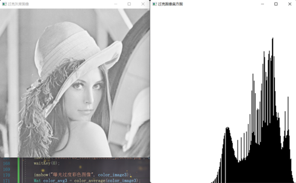
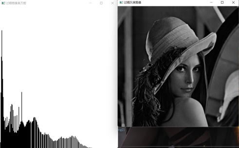

### 1、计算灰度图像的归一化直方图

具体内容：利用OpenCV对图像像素进行操作，计算归一化直方图，并在窗口中以图形的方式显示出来。

完成程度：读入图片，统计不同灰度级的像素个数，并存入大小为256的数组中。设置背景画布的大小，并根据数组中的最大值最小值，将不同灰度级像素点的个数映射到画布当中，通过使用柱线的方式，绘制直方图。

```C++
// 1、计算灰度图像的归一化直方图，并绘制图像
void nomalization(Mat src_image, String name) {
	Mat image = src_image;
	double gray_scale[256] = { 0 };

	int row = image.rows;
	int col = image.cols;

	// 统计不同灰度级的像素个数
	for (int i = 0; i < row; i++) {
		for (int j = 0; j < col; j++) {
			gray_scale[int(image.at<uchar>(i, j))] = gray_scale[int(image.at<uchar>(i, j))] + 1;
		}
	}

	// 绘制直方图
	// 定义背景图像灰度为255
	int length = 500;
	int heigth = 600;
	int reflection = 500;
	// 最大值映射到500
	Mat hist_image = Mat(heigth, length, CV_8U, Scalar(255));

	// 对灰度级进行归一化处理，先求出最大值，最小值默认为0
	double max = 0;
	for (int i = 0; i < 256; ++i) {
		if ((gray_scale[i]) > max) {
			max = gray_scale[i];
		}
	}
	// 将像素点的数量映射到画布上
	for (int i = 0; i < 256; ++i) {
		gray_scale[i] = int(gray_scale[i] * reflection / max);
	}

	// 直线绘制
	for (int i = 0; i < 256; ++i) {
		line(hist_image, Point(i * 2, heigth), Point(i * 2, heigth - gray_scale[i]), Scalar::all(0));
		line(hist_image, Point(i * 2 + 1, heigth), Point(i * 2 + 1, heigth - gray_scale[i]), Scalar::all(0));
	}

	imshow(name, hist_image);
}
```


### 2、灰度图像直方图均衡处理

具体内容:通过计算归一化直方图，设计算法实现直方图均衡化处理。

完成程度：存储灰度图像不同灰度级的像素个数，计算不同灰度级的概率密度。利用公式Sk = （L-1）*[p(r0)到p(rk)的和]对不同灰度进行离散化，完成不同灰度的映射，将映射表存入到数组当中。遍历原始灰度图像的像素点，对照灰度映射表，完成灰度级的转化。

```c++
// 2、灰度图像直方图均衡化处理
// 直方图均衡化的表达式为：Sk = （L-1）*[p(r0)到p(rk)的和]
Mat average_image(Mat src_image) {
	Mat image = src_image;
	Mat result = src_image;
	int row = image.rows;
	int col = image.cols;
	int all_n = row * col;
	int gray_table[256] = { 0 };

	// 存储不同灰度的数量
	double gray_scale[256] = { 0 };

	// 计算不同灰度的概率密度
	for (int i = 0; i < row; ++i) {
		for (int j = 0; j < col; j++) {
			gray_scale[image.at<uchar>(i, j)] = gray_scale[image.at<uchar>(i, j)] + 1;
		}
		
	}

	for (int i = 0; i < 256; ++i) {
		gray_scale[i] = gray_scale[i] / all_n;
	}

	// 将不同的灰度离散化
	for (int i = 0; i < 256; ++i) {
		// 求概率密度的和
		float sum_midu = 0;
		for (int j = 0; j < i; j++) {
			sum_midu = sum_midu + gray_scale[j];
		}
		gray_table[i] = int(255 * sum_midu + 0.5);
		if (gray_table[i] > 255) {
			gray_table[i] = 255;
		}
	}

	// 完成灰度转换
	for (int i = 0; i < row; i++) {
		for (int j = 0; j < col; j++) {

			result.at<uchar>(i, j) = gray_table[image.at<uchar>(i, j)];
		}
	}

	return result;
}
```

过亮图像



处理过后


 

过暗图像



处理过后  


### 3、彩色图像直方图均衡化处理

具体内容:在灰度图像直方图均衡处理的基础上实现彩色直方图均衡处理。

完成程度：将彩色图像的三个颜色通道进行分离并存储在Mat矩阵当中，调用内容2中的直方图均衡化函数，分别对三个通道的直方图进行均衡化处理，处理完毕以后对三个通道进行合并，最终显示该图像。

```c++
// 3、彩色图像直方图均衡化处理
// 将彩色图像中的三个通道提取出来
// 分别做直方图均衡化处理，然后再进行合并
Mat color_average(Mat src) {

	Mat image = src;
	vector<Mat>channels;
	cv::split(image, channels);

	channels[0] = average_image(channels[0]);
	channels[1] = average_image(channels[1]);
	channels[2] = average_image(channels[2]);

	cv::merge(channels, image);

	//imshow("color_image", image);
	return image;
}
```

曝光不足图像处理


曝光过度图像处理

