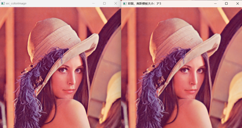
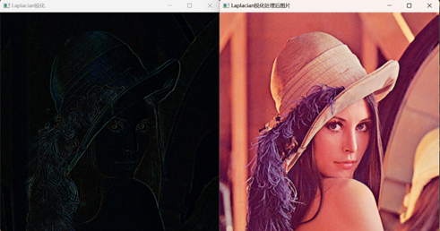

### 1、利用均值模板平滑灰度图像

具体内容: 利用 OpenCV 对图像像素进行操作，分别利用 3*3、5*5 和 9*9 尺寸的均值模板平滑灰度图像。

完成程度：对原图像进行边缘填充，用周围的像素点灰度值代替图像边缘的值，构造了3*3、5*5、7*7的均值模板，对灰度图像进行均值计算操作，将得到的均值赋值给对应的新矩阵。

```C++
// 辅助函数1、对原始灰度图像进行边缘填充操作
Mat fill_zero(Mat image, int size) {
	// 将边缘的填充为与它最近的像素灰度
	int fill_size = int(size / 2);
	int row = image.rows;
	int col = image.cols;

	Mat first_row = image.rowRange(0, 1);
	Mat last_row = image.rowRange(row - 1, row);
	
	// 垂直填充
	for (int i = 0; i < fill_size; ++i) {
		cv::vconcat(first_row, image, image);
		cv::vconcat(image, last_row, image);
	}

	// 水平填充
	Mat left_col = image.colRange(0, 1);
	Mat right_col = image.colRange(col - 1, col);

	for (int i = 0; i < fill_size; ++i) {
		cv::hconcat(left_col, image, image);
		cv::hconcat(image, right_col, image);
	}

	// imshow("填充后", image);
	return image;

}

// 1、利用均值模板平滑灰度图像
Mat average_filter(Mat image, int size) {
	// 构建均值滤波模板
	image.convertTo(image, CV_8U);
	Mat meta = Mat::ones(size, size, CV_8U);

	int count_size = size * size;

	// 对原始图像进行填充操作
	image = fill_zero(image, size);
	int row = image.rows;
	int col = image.cols;
	// 输出图像保存在res中
	Mat res(row-size+1, col-size+1, CV_8U);
	// 使用meta模板对图像进行处理
	for (int i = 0; i < row - size + 1; ++i) {

		for (int j = 0; j < col - size + 1; ++j) {

			int sum_ = 0;
			for (int s = 0; s < size; ++s) {
				for (int t = 0; t < size; ++t) {
					sum_ += image.at<uchar>(i+s, j+t) * meta.at<uchar>(s, t);
				}
			}
			res.at<uchar>(i, j) = sum_/count_size;
		}
	}
	imshow("均值滤波："+ to_string(size) + '*' + to_string(size), res);
	
	return res;

}
```


### 2、利用高斯模板平滑灰度图像

具体内容: 利用 OpenCV 对图像像素进行操作，分别利用 3*3、5*5 和 9*9 尺寸的高斯模板平滑灰度图像。 

完成程度：通过高斯函数自定义构造3*3、5*5、7*7的高斯模板，编写卷积运算的函数，并将原灰度图与所构造的高斯模板进行卷积操作，得到平滑后的图像并输出。

```c++
// 辅助函数2、完成卷积操作
Mat juanji(Mat image, vector<vector<int> > meta, int size_) {

	double sum = 0.0;
	// 求meta元素的和
	//for (int i = 0; i < size; ++i) {
	//	for (int j = 0; j < size; ++j) {
	//		sum += meta[i][j];
	//	}
	//}
	int size = size_ % 2 == 0 ? size_ + 1 : size_;
	int row = image.rows;
	int col = image.cols;
	Mat res = Mat::zeros(row - size + 1, col - size + 1, CV_8U);

	for (int i = 0; i < row - size + 1; ++i) {
		for (int j = 0; j < col - size + 1; ++j) {
			double sum_1 = 0.0;
			for (int s = 0; s < size_; ++s) {
				for (int t = 0; t < size_; ++t) {
					sum_1 += image.at<uchar>(i + s, j + t) * meta[s][t];
				}
			}
			if (sum_1 > 0) {
				res.at<uchar>(i, j) = int(sum_1);
			}
			else {
				res.at<uchar>(i, j) = 0;
			}
		}
	}
	return res;
}

// 2、利用高斯模板平滑灰度图像
Mat gaussion_filter(Mat image, int size, double sigma) {
	// 高斯方程为，h(x,y) = e**-{([(x-x0))**2+(y-y0)**2]/(2*σ**2)]}
	// 其中x0，y0为中心坐标
	// 构造高斯滤波器模板
	vector<vector<double> >gaussion_module(size, vector<double>(size));
	int x0 = (size - 1) / 2;
	int y0 = (size - 1) / 2;
	// 求和
	double sum_ = 0.0;
	for (int x = 0; x < size; ++x) {
		for (int y = 0; y < size; ++y) {
			gaussion_module[x][y] = exp(-(pow((x - x0), 2) + pow((y - y0), 2)) / (2 * sigma * sigma));
			sum_ += gaussion_module[x][y];
		}
	}
	
	// 填充
	image = fill_zero(image, size);

	// Mat res = juanji(image, gaussion_module, size);

	int row = image.rows;
	int col = image.cols;
	Mat res(row - size + 1, col - size + 1, CV_8U);

	// 使用高斯滤波进行卷积操作
	for (int i = 0; i < row - size + 1; ++i) {
		for (int j = 0; j < col - size + 1; ++j) {
			// 卷积和
			double sum_mul = 0.0;
			for (int s = 0; s < size; ++s) {
				for (int t = 0; t < size; ++t) {
					sum_mul += image.at<uchar>(i + s, j + t) * gaussion_module[s][t];
				}
			}
			res.at<uchar>(i, j) = int(sum_mul / sum_);
		}
	}

	imshow("高斯模板尺寸：" + to_string(size) + '*' + to_string(size), res);

	return res;
}
```


### 3、利用 Laplacian、Robert、Sobel 模板锐化灰度图像

具体内容: 利用 OpenCV 对图像像素进行操作，分别利用 Laplacian、Robert、Sobel 模板锐化灰度图像。 

完成程度：分别构造Laplacian、Robert、Sobel模板，用这三个模板分别原始图像进行卷积操作，得到结果后输出

```c++
// 3、利用Laplacian、Robert、Sobel模板锐化灰度图像
vector<Mat> sharpen(Mat image1) {

	imshow("原图", image1);
	// 对原图进行填充
	Mat image = image1;

	//image = average_filter(image, 3);
	image = fill_zero(image, 3);
	// 拉普拉斯模板{0，1，0，1，-4，1，0，1，0}
	vector<vector<int> >laplacian_model = { {0,1,0},{1,-4,1},{0,1,0} };
	vector<vector<int> >laplacian_model2 = { {1,1,1},{1,-8,1},{1,1,1} };
	
	Mat res_laplacian = juanji(image, laplacian_model, 3);

	imshow("Laplacian", res_laplacian);
	subtract(image1, res_laplacian, res_laplacian);
	imshow("Laplacian处理过后的图像", res_laplacian);

	// Robert算子
	vector<vector<int> >robert_model = { {-1,0},{0, 1} };
	Mat image_robert = image1;
	image_robert = fill_zero(image_robert, 2);
	Mat res_robert = juanji(image_robert, robert_model, 2);

	imshow("robert", res_robert);
	add(image1, res_robert, res_robert);
	imshow("Rebort处理过后的图像", res_robert);
	// cout << res_rebort.cols << "sadas" << endl;

	// Sobel算子
	vector<vector<int> >sobel_model = { {-1,-2,-1},{0,0,0},{1,2,1} };
	Mat image_sobel = image1;
	image_sobel = fill_zero(image_sobel, 3);
	Mat res_sobel = juanji(image_sobel, sobel_model, 3);

	imshow("sobel", res_sobel);
	subtract(image1, res_sobel, res_sobel);
	imshow("Sobel处理过后的图像", res_sobel);

	vector<Mat> res = { res_laplacian, res_robert, res_sobel };
	Mat s;
	merge(res, s);
	imshow("get", s);

	return res;

}
```

Laplacian


Robert


Sobel


### 4、利用高提升滤波算法增强灰度图像

具体内容: 利用 OpenCV 对图像像素进行操作，设计高提升滤波算法增强图像。 

完成程度：使用高斯滤波平滑原始图像，将原始图像减去平滑后的图像，得到高斯滤波过滤掉的细节图像，给细节图像乘上一定的倍数（本实验所用的倍数是2），再加到原始图像中，输出图像。

```C++
// 4、利用高提升滤波算法增强灰度图像
void enhance_image(Mat image) {
	// 先对原始图像进行平滑处理
	Mat filt_image = gaussion_filter(image, 3, 1);
	Mat sub_image;
	subtract(image, filt_image, sub_image);

	imshow("dada", sub_image*2);
	Mat res;
	add(image, sub_image, res);
	imshow("高提升后的图像", res);
}
```


### 5、利用均值模板平滑彩色图像

具体内容：利用 OpenCV 分别对图像像素的 RGB 三个通道进行操作，利用 3*3、5*5 和 9*9 尺寸的均值模板平滑彩色图像。

完成程度：在完成了均值滤波平滑灰度图像的基础上，分离彩色图像的三个通道，分别对其三个通道进行平滑处理，完成以后再合并输出。

```c++
// 5、利用均值模板平滑彩色图像
void average_filter_color(Mat image, int size) {

	// 分别对三个通道进行处理
	vector<Mat> channels;
	cv::split(image, channels);

	for (int i = 0; i < 3; i++) {
		channels[i] = average_filter(channels[i], size);
	}
	
	cv::merge(channels, image);

	imshow("彩图", image);

}
```


### 6、利用高斯模板平滑彩色图像

具体内容：利用 OpenCV 分别对图像像素的 RGB 三个通道进行操作，分别利用 3*3、5*5 和 9*9 尺寸的高斯模板平滑彩色图像。

完成程度：在完成了高斯滤波平滑灰度图像的基础上，分离彩色图像的三个通道，分别对其三个通道进行平滑处理，完成以后再合并输出。

```c++
// 6、利用高斯模板平滑彩色图像
void gaussion_filter_color(Mat image, int size) {

	// 分别对三个通道进行处理
	vector<Mat> channels;
	cv::split(image, channels);

	for (int i = 0; i < 3; i++) {
		channels[i] = gaussion_filter(channels[i], size, 1);
	}

	cv::merge(channels, image);

	imshow("彩图", image);
}
```




### 7、利用 Laplacian、Robert、Sobel 模板锐化彩色图像

具体内容：利用 OpenCV 分别对图像像素的 RGB 三个通道进行操作，分别利用 Laplacian、Robert、Sobel 模板锐化彩色图像。

完成程度：构造Laplacian、Robert、Sobel算子，分别对彩色图像的三个通道进行卷积操作，完成以后进行通道合并，并输出合并后的彩色图像。

```c++
// 7、利用Laplacian、Robert、Sobel模板锐化彩色图像
void sharpen_color(Mat image) {

	vector<Mat> channels;
	split(image, channels);

	// Laplacian
	vector<Mat> laplacian_channels = channels;
	vector<Mat> laplacian_channels_color = channels;

	vector<Mat> robert_channels = channels;
	vector<Mat> robert_channels_color = channels;

	vector<Mat> sobel_channels = channels;
	vector<Mat> sobel_channels_color = channels;

	Mat res_laplacian;
	for (int i = 0; i < 3; ++i) {
		vector<vector<int> >laplacian_model = { {0,1,0},{1,-4,1},{0,1,0} };
		vector<vector<int> >laplacian_model2 = { {1,1,1},{1,-8,1},{1,1,1} };

		laplacian_channels[i] = fill_zero(laplacian_channels[i], 3);
		laplacian_channels[i] = juanji(laplacian_channels[i], laplacian_model, 3);

		subtract(channels[i], laplacian_channels[i], laplacian_channels_color[i]);
	}
	merge(laplacian_channels, res_laplacian);
	imshow("Laplacian锐化", res_laplacian);
	merge(laplacian_channels_color, res_laplacian);
	imshow("Laplacian锐化处理后图片", res_laplacian);
	
	// Robert

	split(image, channels);
	Mat res_robert;
	for (int i = 0; i < 3; ++i) {
		vector<vector<int> >robert_model = { {-1,0},{0, 1} };

		robert_channels[i] = fill_zero(robert_channels[i], 2);
		robert_channels[i] = juanji(robert_channels[i], robert_model, 2);

		add(channels[i], robert_channels[i], robert_channels_color[i]);
	}
	merge(robert_channels, res_robert);
	imshow("Robert锐化", res_robert);
	merge(robert_channels_color, res_robert);
	imshow("Robert锐化处理后图片", res_robert);

	// Sobel

	split(image, channels);
	Mat res_sobel;
	for (int i = 0; i < 3; ++i) {
		vector<vector<int> >sobel_model = { {-1,-2,-1},{0,0,0},{1,2,1} };

		sobel_channels[i] = fill_zero(sobel_channels[i], 3);
		sobel_channels[i] = juanji(sobel_channels[i], sobel_model, 3);

		subtract(channels[i], sobel_channels[i], sobel_channels_color[i]);
	}
	merge(sobel_channels, res_sobel);
	imshow("Sobel锐化", res_sobel);
	merge(sobel_channels_color, res_sobel);
	imshow("Sobel锐化处理后图片", res_sobel);
}
```

Laplacian



Robert


Sobel

