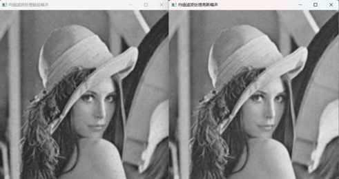
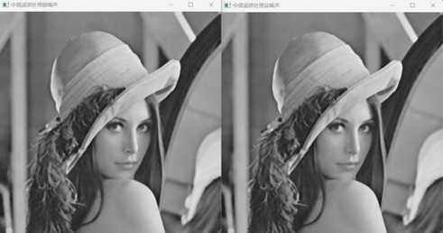

### 1、均值滤波

具体内容: 利用 OpenCV 对灰度图像像素进行操作，分别利用算术均值滤波器、几何均值滤波器、谐波和逆谐波均值滤波器进行图像去噪。模板大小为5*5。（注：请分别为图像添加高斯噪声、胡椒噪声、盐噪声和椒盐噪声，并观察滤波效果）

完成程度：读入灰度图像，分别为图像加入椒噪声、盐噪声、椒盐噪声以及高斯噪声，并使用5*5的模板分别对不同的噪声图像进行处理，处理的过程是用模板中的像素取平均值后赋值给中心像素，最终得到处理结果。

```c++
// 1、均值滤波
Mat average_filter(Mat image1, string s) {
	// 构建均值滤波模板

	Mat image = image1.clone();
	int size = 5;
	image.convertTo(image, CV_8U);
	Mat meta = Mat::ones(size, size, CV_8U);

	int count_size = size * size;

	// 对原始图像进行填充操作
	image = fill_zero(image, size);
	int row = image.rows;
	int col = image.cols;
	// 输出图像保存在res中
	Mat res(row - size + 1, col - size + 1, CV_8U);
	// 使用meta模板对图像进行处理
	for (int i = 0; i < row - size + 1; ++i) {

		for (int j = 0; j < col - size + 1; ++j) {

			int sum_ = 0;
			for (int s = 0; s < size; ++s) {
				for (int t = 0; t < size; ++t) {
					sum_ += image.at<uchar>(i + s, j + t) * meta.at<uchar>(s, t);
				}
			}
			res.at<uchar>(i, j) = sum_ / count_size;
		}
	}


	imshow("均值滤波处理" + s, res);

	return res;

}
void junzhi_quzao(Mat image) {

	imshow("原图", image);

	average_filter(guassion(image), "高斯噪声");
	average_filter(jiao_salty(image), "椒盐噪声");
	average_filter(salty(image), "盐噪声");
	average_filter(jiao(image), "椒噪声");

}
```

添加噪声


均值滤波




### 2、中值滤波

具体内容: 利用 OpenCV 对灰度图像像素进行操作，分别利用 5*5 和 9*9尺寸的模板对图像进行中值滤波。（注：请分别为图像添加胡椒噪声、盐噪声和椒盐噪声，并观察滤波效果） 

完成程度：分别为图像加入椒噪声、盐噪声、椒盐噪声以及高斯噪声，并使用5*5的模板分别对不同的噪声图像进行处理，处理的过程是，将模板内的像素灰度进行排序，取排序后的中间灰度值作为模板中心像素的灰度值，最终得到处理结果。

```c++
// 2、中值滤波
// 将窗口中的点按照从小到大的排序，取中间的值作为窗口中心的值
Mat median_filter(Mat image1, int size, string s1) {
	// 构建均值滤波模板
	Mat image = image1.clone();
	image.convertTo(image, CV_8U);

	// 对原始图像进行填充操作
	image = fill_zero(image, size);
	int row = image.rows;
	int col = image.cols;
	// 输出图像保存在res中
	Mat res(row - size + 1, col - size + 1, CV_8U);
	// 使用meta模板对图像进行处理
	for (int i = 0; i < row - size + 1; ++i) {

		for (int j = 0; j < col - size + 1; ++j) {
			vector<int> num;
			int sum_ = 0;
			for (int s = 0; s < size; ++s) {
				for (int t = 0; t < size; ++t) {
					int k = image.at<uchar>(i + s, j + t);
					num.push_back(k);
				}
			}
			sort(num.begin(), num.end());
			res.at<uchar>(i, j) = num[int(num.size() / 2)];
		}
	}
	imshow("中值滤波处理" + s1, res);

	return res;

}
void zhongzhi_quzao(Mat image) {

	imshow("原图", image);

	median_filter(guassion(image), 5, "高斯噪声");
	median_filter(jiao_salty(image), 5, "椒盐噪声");
	median_filter(salty(image), 5, "盐噪声");
	median_filter(jiao(image), 5, "椒噪声");

}
```




### 3、自适应均值滤波

具体内容:利用 OpenCV 对灰度图像像素进行操作，设计自适应局部降低噪声滤波器去噪算法。模板大小 7*7（对比该算法的效果和均值滤波器的效果） 

完成程度：自适应的均值滤波，可以通过局部的均值方差，以及噪声的均值方差之间的关系，来自动的调整对噪声处理强的大小，将原始图片的方差作为分子，将局部图片的方差作为分母，用7*7的模板对加入高斯噪声的图像进行了处理。

```c++
// 3、自适应均值滤波
// 计算图像全局的方差
double quare_sub(Mat image) {
	// 统计不同灰度的概率密度
	double midu[256] = { 0 };

	int col = image.cols;
	int row = image.rows;

	for (int i = 0; i < row; ++i) {
		for (int j = 0; j < col; ++j) {
			midu[image.at<uchar>(i, j)] += 1;
		}
	}

	int size = col * row;

	// 计算均值
	double med = 0;
	for (int i = 0; i < 256; ++i) {
		med += i * (midu[i] / size);
	}

	// 计算方差
	double quare = 0;
	for (int i = 0; i < 256; ++i) {
		quare += pow((i - med), 2) * (midu[i] / size);
	}

	return quare;
}

// 自适应均值滤波
Mat self_adapt_mean_filter(Mat image, int self_adapt_mean_filter_size) {
	// 滤波窗口尺寸必须为奇数
	Mat pScr, dst;
	// 1为加载图像的颜色类型,1为原图返回,0为灰度返回
	pScr = image.clone();
	int row = pScr.rows;
	int col = pScr.cols;
	blur(pScr, dst, Size(7, 7));
	int pos = (self_adapt_mean_filter_size - 1) / 2;
	double Sn = 100.0;
	// 每个滤波窗口中心位置都计算滤波窗口内通道值的平均值
	for (int m = pos; m < row - pos; m++) {
		for (int n = pos; n < col - pos; n++) {
			int Zxy = int(pScr.at<uchar>(m, n));
			int Zmed = int(dst.at<uchar>(m, n));
			double Sl = 0.0;
			int count = 0;
			for (int i = m - (self_adapt_mean_filter_size - 1) / 2; i <= m + (self_adapt_mean_filter_size - 1) / 2; i++) {
				for (int j = n - (self_adapt_mean_filter_size - 1) / 2; j <= n + (self_adapt_mean_filter_size - 1) / 2; j++) {
					int Sxy = pScr.at<uchar>(i, j);
					Sl += pow(Sxy - Zmed, 2);
					count++;
				}
			}
			Sl = Sl / count;
			pScr.at<uchar>(m, n) = (int)(Zxy - Sn / Sl * (Zxy - Zmed));

		}
	}
	return pScr;
}
void self_adapt(Mat image, int size) {
	Mat res = image.clone();
	
	res = guassion(res);
	imshow("加入高斯噪声后图片", res);
	res = self_adapt_mean_filter(res, size);
	imshow("使用自适应均值滤波", res);
}
```


### 4、自适应中值滤波

具体内容: 利用 OpenCV 对灰度图像像素进行操作，设计自适应中值滤波算法对椒盐图像进行去噪。模板大小 7*7（对比中值滤波器的效果） 

完成程度：自适应的中值滤波和自适应的均值滤波具有相似的原理，与均值滤波不同的便是，中值滤波适应的是模板的大小，而均值滤波适应的是去噪比例大小。

```c++
//4、自适应中值滤波
// 自适应中值滤波
Mat self_adapt_median_filter(Mat image, int self_adapt_median_filter_size) {
	// 滤波窗口尺寸必须为奇数
	Mat pScr = image.clone();
	// 1为加载图像的颜色类型,1为原图返回,0为灰度返回
	int row = pScr.rows;
	int col = pScr.cols;
	int channel = pScr.channels();
	// 滤波器窗口的起始尺寸
	int pos = (self_adapt_median_filter_size - 1) / 2;
	// 每个滤波窗口中心位置都计算滤波窗口内通道值的平均值
	for (int m = pos; m < row - pos; m++) {
		for (int n = pos; n < col - pos; n++) {
			int minValue = 255;
			int maxValue = 0;
			int medValue = 0;
			vector<int> filter_value;
			for (int i = m - (self_adapt_median_filter_size - 1) / 2; i <= m + (self_adapt_median_filter_size - 1) / 2; i++) {
				for (int j = n - (self_adapt_median_filter_size - 1) / 2; j <= n + (self_adapt_median_filter_size - 1) / 2; j++) {
					filter_value.push_back(int(pScr.at<uchar>(i, j)));
					if (int(pScr.at<uchar>(i, j)) > maxValue)
						maxValue = int(pScr.at<uchar>(i, j));
					if (int(pScr.at<uchar>(i, j)) < minValue)
						minValue = int(pScr.at<uchar>(i, j));
				}
			}
			sort(filter_value.begin(), filter_value.end());
			medValue = filter_value[int(self_adapt_median_filter_size * self_adapt_median_filter_size / 2)];
			int fxy = int(pScr.at<uchar>(m, n));
			if (medValue > minValue && medValue < maxValue)
				if (fxy <= minValue || fxy >= maxValue)
					pScr.at<uchar>(m, n) = medValue;
				else
					pScr.at<uchar>(m, n) = medValue;
		}
	}
	
	return pScr;
}

void self_median(Mat image, int size) {

	Mat res = image.clone();
	res = guassion(res);
	res = self_adapt_median_filter(image, 7);
	imshow("使用自适应中值滤波", res);
	
}
```


### 5、彩色图像均值滤波 

具体内容: 利用 OpenCV 对彩色图像 RGB 三个通道的像素进行操作，利用算术均值滤波器和几何均值滤波器进行彩色图像去噪。模板大小为 5*5。

完成程度：分别对彩色图像的三个通道加入高斯噪声，然后再合并三个通道，得到的便是加入有高斯噪声的彩色图像。通过对带有噪声的彩色图像进行通道分离，再分别使用自适应的均值滤波对三个通道进行处理，最终合并以后便是，处理的结果。

```c++
//5、彩色图像均值滤波
void color_quzao(Mat image, int size) {
	vector<Mat>channels;
	vector<Mat>channels1;
	split(image, channels);
	channels1 = channels;

	for (int i = 0; i < 3; ++i) {
		channels[i] = guassion(channels[i]);
	}
	Mat res;
	Mat res1;
	merge(channels, res);

	imshow("彩色图像加入高斯噪声", res);
	for (int i = 0; i < 3; ++i) {
		channels[i] = self_adapt_mean_filter(channels[i].clone(), 7);

		channels1[i] = self_adapt_median_filter(channels[i].clone(), 7);
	}

	merge(channels, res);
	merge(channels1, res1);
	imshow("自适应均值滤波处理彩色图像", res);
	imshow("自适应中值滤波处理彩色图像", res1);

}
```


