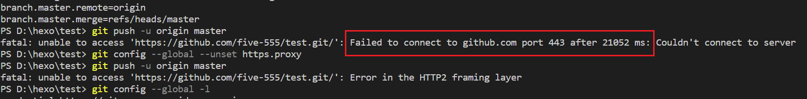
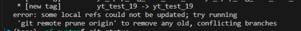

**实习中使用git经验**

类似的应用类的工具，最好是在实践应用当中积攒相关经验，有了两端实习经历，发现在不同的实习单位，对于`git`的使用规范都有一定的要求，并且不同单位可能要求也有所不一样。

第一家单位在对代码仓库进行管理的时候，因为团队的人数不多，在远程的分支不会很多，本地的分支不会轻易的往远程进行推送，更多的是，如果有新的`feature`，会由系统管理员开启一个分支，而参与到这个`feature`开发的人员使用同一个分支来完成，通常参与到同一个`feature`开发的人员不会很多，也就是2-5人，所以会共同在这一个分支上开发。开发流程就是，先拉取，后推送，如果有冲突，直接在本地自行`merge`解决，涉及到其他开发人员的共同`review`关联代码，当完成一个`feature`以后，将分支合入主线。

而另一家单位，由于团队人员比较多，代码模块也比较大，所以开发人员在开发的过程中，每天都会先从`feature`的分支中切出一个自己的分支，会在自己的分支上进行开发，开发完以后，再将自己分支合入到`feature`，而合入的过程也并不是简单粗暴的使用`git merge`，而是使用`git cherry-pick -i`将自己分支的`commit`一个一个交互式的`pick`到`feature`分支上。如果`commit`比较多的话，会使用`git rebase`先压缩`commit`以后再进行`pick`。

相比之下，个人认为第二种方式会更加规范一些，适合开发团队较大的企业。属于某个人的分支也能够很精准的定位到个人，通过`git graph`插件工具查看所有分支以后，可以很震惊的发现，使用这样的方式，在远端的所有分支，不会有交叉，每一条分支，无论是个人的分支还是统一的分支都是平行的往前推进的。但是不好的地方就是，当分支使用完毕以后，往往会忘记删除，导致远程分支太多，需要专门去管理对应的分支。

分割线
——————————————————————————————————————

## 怎样撤销一个已经push到远端的版本

```
每次push之前线pull一下

1、查看当前提交的信息，找到需要撤回到的版本号复制，一串十六进制的数
git log

2、使用git reset
git reset --soft 复制的版本号

3、强制回退当前版本号
// 确认一下当前版本
git log
// 谨慎使用，强制使用本地仓库代码修改远程仓库
git push orgin master --force
```

## 新建分支并同步到远端的分支

```
# 在本地新建一个名字为branch_name的分支，并与远端的origin/branch_name同步
git checkout -b branch_name origin/branch_name
```

## 解决git clone超时的问题

从github上clone代码仓库报错`Failed to connect to github.com port 443 after 21038 ms: Couldn't connect to server`且尝试去ping一下github官网会丢包


解决方案

修改系统的hosts，跳过域名解析的过程，直接用ip地址访问

```
192.30.255.112 github.com git
185.31.16.184 github.global.ssl.fastly.net
```


修改hosts需要给文件更高的权限


## github中git push出现超时的问题



解决方案

1、打开本机的代理服务器


2、取消git config里面的http和https代理


3、设置http代理服务器


## linux中输出一个文件夹下面的所有文件名

- **`/path/to/directory`**: 替换为目标目录的路径。
- **`-maxdepth 1`**: 限制`find`的搜索深度为1，即仅在指定的目录中搜索，而不会搜索其子目录。
- **`-type f`**: 限制搜索结果为普通文件（不包括目录和其他类型的文件）。
- **`-exec basename {} \;`**: 对每一个找到的文件执行`basename`命令，即输出文件的基本名称。`{}`是`find`命令的占位符，表示每个找到的文件的路径。`\;`表示命令结束。

```
find /path/to/directory -maxdepth 1 -type f -exec basename {} \;
```

## git查看远端仓库地址

```
git remote -v

# 更改远程仓库
git remote set-url origin 仓库地址
```

## 查看代码贡献量

> 按照各个作者的修改代码总数排序

```
git log --pretty="%aN" | sort | uniq -c | while read count author; do echo -n "$author "; git log --author="$author" --pretty=tformat: --numstat | awk '{ add += $1; subs += $2 } END { total = add + subs; printf "%d\n", total }'; done | sort -rnk2
```

## git pull 报错



如果我们远程有一些分支已经删除，但是本地还存在有远程已经删除的分支的引用，`git pull`就会拉取失败。这个时候我们需要先将本地与远程同步，删除本地在远程未引用的分支，然后再次拉取代码。

```git
git remote prune origin

git pull
```