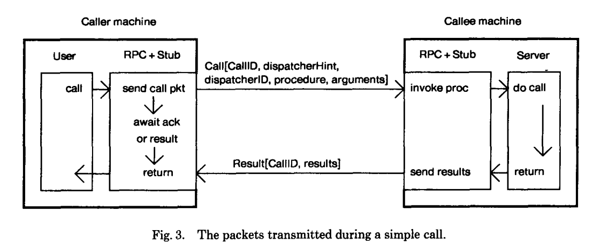

# RPC（Remote Procedure Calls）

> [论文链接:http://birrell.org/andrew/papers/ImplementingRPC.pdf](http://birrell.org/andrew/papers/ImplementingRPC.pdf)

这篇论文主要讲了实现远程过程调用，远程过程调用通俗的来讲是在一台计算机A上的进程，调用另一台计算机B上的进程，其中A上调用进程被挂起，而B上的调用进程开始执行，当值返回给A时，A进程继续执行。调用放可以通过使用参数信息传送给被调用方，而后通过传回的结果得到信息。这一过程对于开发人员来说是透明的。

## 结构

当进行远程调用时，有五个程序部分参与：用户、用户存根、RPC通信包（RPCRuntime）、服务器存根和服务器。其中用户、用户存根和`RPCRuntime`的一个实例在调用者机器上执行；服务器、服务器存根和`RPCRuntime`的另一个实例在被调用者机器上执行。

当用户希望进行远程调用时，它实际上进行一个完全正常的本地调用，调用对应的用户存根中的过程。用户存根负责将目标过程和参数的规格说明放入一个或多个数据包中，并请求`RPCRuntime`将这些数据包可靠地传输到被调用者机器。在接收到这些数据包后，被调用者机器上的`RPCRuntime`将它们传递给服务器存根。服务器存根解包这些数据包，然后再次进行一个完全正常的本地调用，调用适当的过程。同时，调用者机器中的调用进程被挂起，等待结果数据包。当服务器中的调用完成时，它返回到服务器存根，并将结果传回给调用者机器中的挂起进程。在那里，结果被解包，用户存根将它们返回给用户。`RPCRuntime`负责重传、确认、数据包路由和加密。除了多机绑定和机器或通信故障的影响外，这次调用就像用户进行了一次简单的单机调用。

# 绑定

绑定极致涉及两个方面。一是绑定机制的客户如何指定他们希望绑定到什么，二是调用者如何确定被调用者的机器地址，并向被调用者指定要调用的过程。即命名问题和位置问题。

## 命名

`RPC`包提供的绑定操作是将一个接口的导入者绑定到一个接口的导出者，绑定以后，导入者进行的调用会调用（远程）导出者实现的过程。

接口名称有两个部分：类型和实例。类型用于在某种抽象层次上指定`调用者`期望`被调用者`实现的接口。实例用于指定从多个实现中选择的特定实现。从根本上说，接口名称的语义不是由RPC包规定的——它们是导出者和导入者之间的协议，不能完全由RPC包强制执行。然而，导出者使用接口名称定位导出者的方法由RPC包规定。

## 定位适当的导出者

在论文中使用`Grapevine`分布式数据库来完成的绑定，服务消费者和服务提供者都和数据库交互，`Grapevine`在多个服务器上分布，并维护每个数据库条目至少三分副本，可以保证数据的可靠性和可用性。`RPC`只关心两项内容，连接站点（及网络地址）和成员列表（RName列表），`Grapevine`数据库可以维护对应的数据，类似于提供一个服务注册的数据库。

当导出者希望使其接口可供远程客户端使用时，服务端代码调用服务器存根，服务器存根调用`RPCRuntime`中的`ExportInterface`过程。

`ExportInterface`给定接口名称（类型和实例），以及一个由服务器存根实现的过程（称为调度程序），该过程将处理接口的传入调用。`ExportInterface`调用`Grapevine`，并确保实例是`Grapevine`组（即类型）的成员，并且实例（即`Grapevine`个人）的连接站点是导出机器的网络地址。

当导入者希望绑定到导出者时，用户代码调用其用户存根，用户存根转而调用`RPCRuntime`中的`ImportInterface`过程，给定所需的接口类型和实例。`RPCRuntime`通过向`Grapevine`请求接口实例的连接站点来确定导出者的网络地址（如果有）。然后，`RPCRuntime`发起一个远程过程调用到该机器上的`RPCRuntime`包，要求该接口类型和实例的绑定信息。如果指定的机器当前没有导出该接口，这一事实会返回给导入机器，绑定失败。如果指定的机器当前正在导出该接口，那么其`RPCRuntime`维护的当前导出表将产生相应的唯一标识符；标识符和表索引返回给导入机器，绑定成功。导出者的网络地址、标识符和表索引由用户存根记住，用于后续的远程调用。

随后，当该用户存根对导入的远程接口进行调用时，它制造的调用数据包包含所需接口的唯一标识符和表索引，以及接口中所需过程的入口点号。当被调用机器上的`RPCRuntime`接收到新的调用数据包时，使用索引查找当前导出表，验证数据包中的唯一标识符是否与表中的匹配，并将调用数据包传递给表中指定的调度程序过程。

# 数据包级传输协议

> 追求的目标：

> 一、尽量减少发起调用和获得结果之间的实时时间消耗。

> 二、努力将大量用户对服务器施加的负载降到最低。

## 简单调用

要进行调用，调用方会发送一个包调用标识符、指定所需过程的数据（与绑定相关的描述）和参数的调用包。当被调用机器收到此数据包时，将调用适当的过程。当过程返回时，将包含相同调用标识符的结果包和结果发送给调用者。

传送数据包的机器负责重新传送数据包，直到收到确认信息，以补偿丢失的数据包，很显然，如果我们能够收到调用的结果，那实际上就是对调用包已接受的充分确认，而调用包也足以确认由该进程发出的前一个调用的结果包，以及再往前的结果包，因为进程在进行`RPC`的过程中，会进入挂起状态，所以我们可以理解`RPC`在同一个客户端上是线性完成的。

如果呼叫持续时间较长或呼叫之间的间隔较长，最多可以发送两个额外的包(重传和一个明确的确认包)；`RPC`认为这是可以接受的，因为在这些情况下，通信成本显然不再是性能的限制因素。

**调用标识符的用途**

> 允许调用者确定结果包确实是他当前调用的结果，而不是之前某个调用的延迟很久的结果。

> 允许被调用者消除重复的调用包，例如由重新传输引起的。

调用标识符由调用机器标识符（永久且全局唯一的）、调用进程的机器相对标识符、序列号组成。

称这一对[机器标识符, 进程]为活动。活动的重要属性是每个活动在任何时候最多有一个未完成的远程调用，即这个活动没有完成就不会发起一个新的调用，直到它收到了前一个调用的结果。

这个图的大致流程就是，调用方会