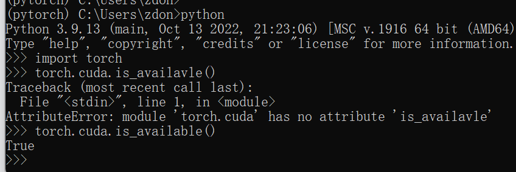

## PyTorch

### 1、Pytorch的安装以及环境管理

```
# 安装环境
conda create -n pytorch python=3.9

# 激活环境，进入pytorch环境下
conda activate pytorch
```

* 查看对应显卡类型，显卡算力以及需要下载的CUDA版本

> 显卡型号：GeForce RTX3060
>
> 显卡算力：8.6
>
> CUDA SDK 11.1 – 11.4 support for compute capability 3.5 – 8.6 (Kepler (in part), Maxwell, Pascal, Volta, Turing, Ampere (in part)).
>
> CUDA SDK 11.5 – 11.7.1 support for compute capability 3.5 – 8.7 (Kepler (in part), Maxwell, Pascal, Volta, Turing, Ampere)
>
> CUDA版本：11.5-11.7
>
> 显卡驱动：11.6

* 进入pytorch官网，pytorch.org


* 选择对应型号

> 复制选中的内容，粘贴至pytorch环境下的命令中
>
> conda install + 包

```
# conda的安装包命令 -c pytorch，表示默认从官网下载，会很慢
conda install pytorch torchvision torchaudio cudatoolkit=11.6 -c 下载地址
```

* 安装过后检查安装包的情况

```
# 使用以上命令安装过后，会自动安装一个cpuonly的包，有这个包就不能使用gpu
conda list

# 卸载cpionly的包
conda uninstall cpuonly

# 输入yes后会更改pytorch torchvision torchaudio cudatoolkit=11.6
conda list
# 再次查看，就会发现
```


* 验证是否可以使用gpu

```
# 进入pytorch环境下
# pip list 查看环境下的包
# 输入python，进入解释器
import torch 
torch.cuda.is_available()
# 返回为True
```



### 2、Pytorch

* 两大法宝内置函数

> dir()，打开操作，看到有什么函数
>
> help()，说明书，如何使用

* 加载数据

> `Dataset`类：提供一种方式取获取数据及其`label`值
>
> `Dataloader`类：为网络提供不同的数据形式，打包Dataset类

​		使用dataset类的实战

```
from torch.utils.data import Dataset
from PIL import Image
import os

# 继承Dataset类
class MyData(Dataset):

    # 构造函数，为后面的方法提供变量
    def __init__(self, root_dir, label_dir):
        self.root_dir = root_dir
        self.label_dir = label_dir
        self.path = os.path.join(root_dir, label_dir)
        # 图片所有地址
        self.img_path = os.listdir(self.path)

    # 读取第idx张图片
    def __getitem__(self, idx):
        img_name = self.img_path[idx]
        img_item_path = os.path.join(self.root_dir, self.label_dir, img_name)
        img = Image.open(img_item_path)
        label = self.label_dir
        return img, label

    def __len__(self):
        return len(self.img_path)

root_dir = "data\\train"
label_dir = "ants"
ants_dataset = MyData(root_dir, label_dir)

# 读取第0张图片
img, label = ants_dataset[0]

```


* PIL简单用法

```
from PIL import Image
# 读取图片文件
img = Image.open("文件路径")
# 显示图片
img.show()
```

* os用法

```
# 将文件夹下的文件名作为列表返回
os.listdir(文件夹名)

# 将两个文件路径拼接起来
os.path.join(路径1, 路径2)
```

### 3、Tensorboard的使用

> 使用Tensorboard的时候，可以将训练的数据图像在网页端监控

* 需要：pip install tensorboard
* 在Terminal中输入：tensorboard --logdir=logs  --port=***
  * 主义输入的文件名不用加引号

* 点击链接，可以指定端口号
* 在使用过程中，不同的图片要用不同的tag

```
# 写入变化函数
from torch.utils.tensorboard import SummaryWriter

write = SummaryWriter("logs")
#write.add_image()
# 可以传入标题等

for i in range(100):
    write.add_scalar("y=2x", 2*i, i)

write.close()

```

​		对图片的显示

```
from torch.utils.tensorboard import SummaryWriter
import numpy as np
from PIL import Image

write = SummaryWriter("logs")
image_path = "dataset\\train\\ants_image\\0013035.jpg"
img_PIL = Image.open(image_path)
img_array = np.array(img_PIL)

print(img_array.shape)

write.add_image("test", img_array, 1, dataformats='HWC')

write.close()
```

### 4、Torchvision中的transforms

* transforms工具箱：将特定格式的图片通过转化输出图片变化结果
  * `transforms.ToTensor`：将图片或`numpy.ndarray`数据转化为`Tensor`数据
  * `ToPILImage`：将Tensor数据类型转化为ndarray数据类型或PIL数据类型
  * `transforms.Normalize`：图片的归一化，输入均值列表、标准差列表，列表长度为通道数
  * `Resize`：设计图片的尺寸，若给定两个参数，则进行裁剪，若输入一个参数，则等比缩放，参数以元组的形式
  * `Compose`：流水线的集合，数据是transforms类型，提供一个操作的列表
* Tensor数据类型
  * Tensor数据类型中包装了神经网络的一些数据参数，因此需要将图片的文件转化为Tensor数据

* 输入：PIL、Image.open()
* 输出：tensor、ToTensor()
* 作用：ndarray()、cv.imread()

### 5、Torchvision中的数据集的使用

* dataset
* dataloader：数据加载器，从数据集中取数据
