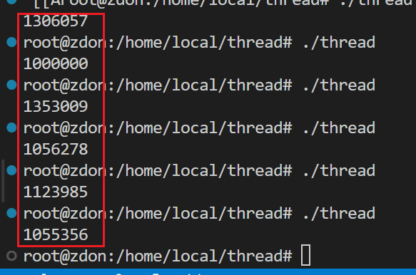
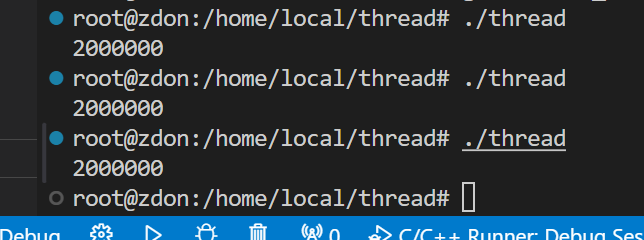
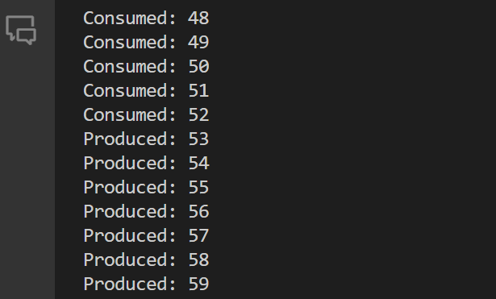

## C++11多线程编程

### C++11 Thread线程库的基本用法

> 进程：运行中的程序，线程：进程中的进程
>
> 一个操作系统可以有多个进程，一个进程中可以有多个线程，线程的最大数量取决于电脑CPU的核数

导入头文件thread

* 创建线程	`thread th(function, arg)`

创建线程需要绑定一个函数，function表示已经定义的函数名，通过arg可以传入函数的参数，线程在std标准库当中

创建线程对函数加引用`&`和不加引用的区别

当线程需要执行的函数中需要使用引用传递参数时，在主线程中传入变量值，程序将无法通过编译，需要使用`std::ref`来确保引用传递

```C++
void threadFunction(int &x) {
    // 现在x确实是主线程中x的引用
}

int main() {
    int x = 0;
    // 编译报错
    // std::thread t(threadFunction, x)
    std::thread t(threadFunction, std::ref(x)); // 使用std::ref来确保引用传递
    t.join();
    // 现在主线程的x可能会被子线程修改
    return 0;
}
```

* `join`和`detach`

join：调用此接口，当前线程会一直阻塞，直到目标线程完成，如果目标线程十分耗时，主线程会一直阻塞。让主线程等待其他线程结束以后才结束。

`detach`：让目标线程称为守护线程（daemon threads）。一旦detach之后，目标线程将独立执行，即便其对应的thread对象销毁也不影响线程的执行，并且，无法再与其通信

可以通过`joinable()`接口查询是否可以对接口进行join和detach

### 互斥量解决多线程数据共享问题

当一个资源需要被多个线程进行使用并修改的时候，就会存在资源的冲突

下面的函数线程`t`和`t2`都需要对变量`a`进行1000000次的自增操作，因为线程的并行操作，所以两个线程在进行取a的值的时候，有可能获取到同样的值，再次写回时，原本需要+2最终只完成了+1，或者运行较快的线程的写入值会被运行较慢的线程覆盖，这就导致了结果会小于原来预期的值

```c++
#include <thread>
#include <iostream>

void thread_function(int& a){
    for (size_t i = 0; i < 1000000; i++)
    {
        a += 1;
    }
    
}

int main(){
    int a = 0;

    std::thread t(thread_function, std::ref(a));
    std::thread t2(thread_function, std::ref(a));

    t.join();
    t2.join();

    std::cout<<a<<std::endl;
    
}
```



这个情况就需要两个线程对a进行互斥使用，用到`mutex`

在需要对资源`a`进行访问的前后，分别进行加锁和解锁，确保这一段临界区只由一个线程访问

```c++
#include <thread>
#include <iostream>
#include <mutex>

// 互斥信号量
std::mutex m;

void thread_function(int& a){
    for (size_t i = 0; i < 1000000; i++)
    {
        // 加锁
        m.lock();
        a += 1;
        m.unlock();
    }
    
}

int main(){
    int a = 0;

    std::thread t(thread_function, std::ref(a));
    std::thread t2(thread_function, std::ref(a));

    t.join();
    t2.join();

    std::cout<<a<<std::endl;
    
}
```



### lock_guard与unique_lock

* lock_guard

lock_guard是一种互斥量封装类，用于保护共享数据，防止多个线程同时访问统一资源而导致数据竞争问题

当构造函数被调用时，该互斥量会被自动锁定

当析构函数被调用时，该互斥量会自动解锁

该对象不能复制或移动，只能在局部作用域中使用

使用到的就是RAII思想

```c++
std::mutex m;

void thread_function(int& a){
    for (size_t i = 0; i < 1000000; i++)
    {
        std::lock_guard<std::mutex> lg(m);
        // m.lock();
        a += 1;
        // 不需要对锁释放，当作用域结束自动释放
        // m.unlock();
    }
}
```

* unique_lock，构造函数会自动加锁，传入`std::defer_lock`后会延迟加锁

unique_lock是一个互斥量封装类，用于在多线程中对互斥量进行加锁和解锁操作，特点是，可以对互斥量进行更加灵活的管理，包括延迟加锁、条件变量、超时等

`lock()`：尝试对互斥量进行加锁，如果当前互斥量被其他线程持有则会阻塞

`try_lock()`L：尝试对互斥量进行加锁，如果被占有则返回false

`try_lock_for(const std::chrono::duration<Rep, Period>& rel_time)`：尝试加锁，如果被占有，则超时以后会释放

### std::call_once使用场景

单例设计模式是一种常见的设计模式，用于确保某个类只能创建一个实例，由于单例实例是全局唯一的，因此在多线程环境中使用单例模式时，需要考虑线程安全的问题

```c++
// 单例模式
class Log{
private:
    Log() {};
public:
    Log(const Log& log) = delete;
    Log& operator=(const Log& log) = delete;
    
    static Log& GetInstance(){
        static Log * log = nullptr;
        if(!log){
            log = new Log();
        }
        return log;
    }
    
    void PrintLog(std::string msg){
        std::cout << msg << std::endl;
    }
}
```

在多线程的情况下，如果都需要使用到同一个单例，当多个线程同时获取log时，如果此时log都为空，单例就会被多次初始化，违背了单例模式的设计初衷

`call_once`可以确保某个函数指挥被调用一次

call_once只能在线程中使用

```c++
// 原型
template<class Callable, class... Args>
void call_once(std::once_flag&flag, Callable&& func, Args&&...args);
```

对单例模式的修改

```c++
// 单例模式
class Log{
private:
    Log() {};
public:
    // 声明一个变量
    static std::once_flag once;
    Log(const Log& log) = delete;
    Log& operator=(const Log& log) = delete;
    
    static Log& GetInstance(){
        static Log * log = nullptr;
        
        // 单次调用
        std::call_once(once, init);
        return log;
    }
    // 封装一个初始化的函数
    static void init(){
        if(!log){
            log = new Log();
        }
    }
    
    void PrintLog(std::string msg){
        std::cout << msg << std::endl;
    }
}
```

### condition_variable使用场景

使用步骤如下

* 创建一个std::condition_variable对象

* 创建一个互斥锁std::mutex，用来保护共享资源的访问

* 在需要等待条件变量的地方

  使用std::unique_lock< std::mutex >对象锁定互斥锁并调用std::condition_variable::wait_for()或std::condition_variable::wait_until()函数等待条件变量

* 在其他线程中需要通知等待的线程时，调用std::condition_variable::notify_one()或者std::condition_variable::notify_all()函数通知等待的线程

生产者消费者模型

```c++
#include <string>
#include <mutex>
#include <queue>
#include <thread>
#include <iostream>
#include <condition_variable>

std::queue<int> q;
std::condition_variable cv;
std::mutex m;

void Producer(){
    for (size_t i = 0; i < 100; i++)
    {
        std::unique_lock<std::mutex> ul(m);
        q.push(i);
        cv.notify_one();
        std::cout<<"Produced: "<<i<<std::endl;
        std::this_thread::sleep_for(std::chrono::microseconds(10000));
    }
}

void Consumer(){
    while(1)
    {
        std::unique_lock<std::mutex> ul(m);
        cv.wait(ul, []{return !q.empty();});
        std::cout<<"Consumed: "<<q.front()<<std::endl;
        q.pop();
    }
}

int main(){
    std::thread t1(Producer);
    std::thread t2(Consumer);

    t1.join();
    t2.join();
    
    return 0;
}
```



### 线程池的实现

维护一个线程数组：可以初始化线程的个数

维护一个任务队列：当前正在进行的任务

线程数组负责从队列取任务，生产者负责从任务队列里加任务（需要提供加任务的接口）


构造函数中指定起始线程的个数，初始化线程，每一个线程都在循环的在任务队列里取任务并完成，给用户提供一个接口，不断的往任务队列中添加任务，并且每次添加任务过后会通知一个维护的线程去完成任务

每一次访问tasks和stop变量的时候，这是临界区，都需要进行加锁

```c++
#include <mutex>
#include <queue>
#include <thread>
#include <iostream>
#include <functional>
#include <condition_variable>

class ThreadPool
{
private:
    std::vector<std::thread> threads;
    std::queue<std::function<void()>> tasks;
    std::condition_variable cv;
    std::mutex m;
    bool stop;

public:
    // 构造函数，构造一共大小为n的线程池
    // 每一个线程执行的函数是检查tasks是否为空，或者stop是否为true
    // 从tasks中取出任务执行，取任务的时候，和访问stop的时候都需要加锁
    ThreadPool(int n) : stop(false){
        for( int i = 0; i < n; ++i ){
            threads.emplace_back([this]{
                while(true){
                    std::unique_lock<std::mutex> ul(m);
                    cv.wait(ul, [this]{
                        return stop || !tasks.empty();
                        });

                    if( stop && tasks.empty() ){
                        return;
                    }

                    // 使用右值引用，避免拷贝
                    std::function<void()> task(std::move(tasks.front()));
                    tasks.pop();
                    ul.unlock();
                    task();
                }
            });
        }
    }

    // 析构函数，将stop置为true，然后notify_all
    // 然后join所有的线程
    ~ThreadPool(){
        {
            std::unique_lock<std::mutex> ul(m);
            stop = true;
        }
        cv.notify_all();
        for( auto& t : threads ){
            t.join();
        }
    }

    // 添加任务，将任务放入tasks中，然后notify_one
    // 用到模板以及多个变量的传参，可以使用通用型函数
    template<class F, class... Args>
    void enqueue(F&& f, Args&&... args){
        // 使用std::bind将传入的函数和参数绑定
        // 因为传入的是万能引用，使用forward可以让参数自动选择是右值还是左值引用
        std::function<void()> task = std::bind(std::forward<F>(f), std::forward<Args>(args)...);
        {
            std::unique_lock<std::mutex> ul(m);
            tasks.emplace(std::move(task));
        }
        // 通知一个线程执行任务
        cv.notify_one();
    }

};

int main(){
    ThreadPool tp(4);
    for( int i = 0; i < 8; ++i ){
        tp.enqueue([i]{
            // 用printf而不是cout，避免输出混乱
            printf("Thread %d is working\n", i);
            std::this_thread::sleep_for(std::chrono::seconds(1));
            printf("Thread %d is done\n", i);
        });
    }
    return 0;

}
```

* 使用cout输出

cout的单个输出是线程安全的，这种线程安全是针对在操作系统层面，即每一次`<<`的调用都是原子的，但是多个`<<`进行串联输出的时候，整个表达式并不是原子的，因此在串联输出的过程中，会被其他输出线程打断


* 使用printf输出

> printf("Thread %d is working\n", i);

使用printf输出则是将串联的输出转化为单一的输出，因此单条语句不会产生混乱，但是多个线程输出还是会产生混乱。


