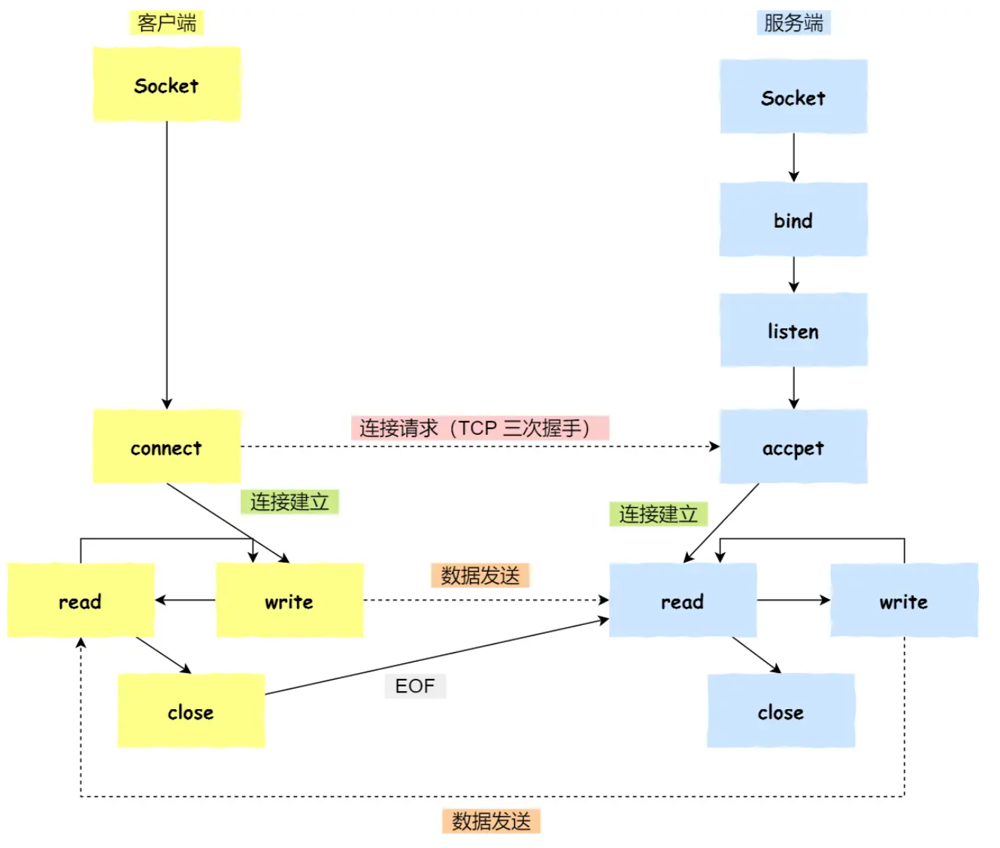

## 进程间的通信方式

每个进程的用户地址空间是独立的，一般情况之下，不同的进程是**无法**通过进程间各自的地址空间来进行互相访问，但是不同的进程所拥有的内核空间是共享的，因此如果不同进程之间需要进行通信必须要通过内核。

### 管道通信

管道通信分为匿名管道和命名管道，通过名字可以区分，匿名管道是无法获取和控制的管道，命名管道是通过用户可以自己建立的管道。

管道智能进行半双工的通信，即数据传输是单向的，如果想要实现互相通信，就需要创建两个管道。

#### 匿名管道

* 在linux中的`|`竖线就是一个管道，将管道符前的操作的输出作为管道符后的操作的输入

一个匿名管道的创建会使用到下面的系统调用

```C++
int pipe(int fd[2]);
```

表示创建了一个匿名管道并返回了两个文件描述符，一个是管道读取端的描述符`fd[0]`，另一个是管道写入端的描述符`fd[1]`，**匿名管道是特殊的文件，只存在于内存当中，不存在于文件系统中**

管道实际上就是内核中的一串缓存，进程通过文件描述符来对这一串缓存进行读写操作


**如果说需要实现多个进程之间的通信**，可以使用`fork`操作来创建子进程，创建子进程时，子进程会同时复制父进程的文件描述符，两个进程便可以通过各自的文件描述符来进行跨进程之间的通信。


通过对文件描述符的开放和关闭，可以控制父进程和子进程之间的读写操作。

* 如：父进程关闭读取的 fd[0]，只保留写入的 fd[1]；子进程关闭写入的 fd[1]，只保留读取的 fd[0]；
* 便可以实现从父进程向子进程的数据写入

实现多个进程之间匿名管道的通信另一种方式就是fork两个子进程，关闭父进程的文件描述符，开启子进程的`fd`，实现子进程之间的通信。

可以看出来，匿名管道的通信范围仅限于父子关系的进程。因为管道没有实体，没有管道文件，只能通过复制父进程的fd来使用文件描述符。

#### 命名管道

* 在linux中可以通过`mkfifo`命令来创建并指定管道名字

```
mkfifo myPipe
```

因为命名管道，提前创建了一个类型为管道的设备文件，在进程中只要使用到这个设备，便可以互相通信。

**管道的通信方式，效率较低，不适合进程间的频繁交换数据**

### 消息队列

> 在管道通信的缺点下，消息队列可以解决进程间频繁交换数据的问题。

消息队列是保护在内核中的消息列表，如果进程之间需要进行通信，只需要将消息放在对应的消息队列中便可以正常返回，无需阻塞等待，等到另一个进程需要的时候去消息队列中去读取便可以。

如果消息队列没有释放或者没有关闭操作系统，消息队列会一直存在，而匿名管道则是随着进程的生命周期的结束而销毁。

* 优点

  * 解决频繁交换数据的问题

    两个进程之间就像发邮件一样可以你来我往进行沟通

  * 进程发送消息后无需阻塞等待消息的接收

* 缺点

  * 不适合比较大的数据传输

    消息队列中的消息体是由结构化的数据结构来组织的，有最大长度的限制。

  * 消息队列的通信过程中，存在用户态与内核态之间的数据拷贝开销

### 共享内存

共享内存用到的是现代操作系统中的内存管理的**虚拟内存技术**，每个进程都有自己独立的虚拟内存空间，不同进程的虚拟内存映射到不同的物理内存中。

**共享内存的机制：拿出一块虚拟地址空间，映射到相同的物理内存中。**不同的进程可以使用各自的虚拟地址访问到这一片相同的物理内存。


* 优点
  * 解决了消息队列中不适合大的数据的通信
  * 不同进程之间无需进行频繁的用户态和内核态的转换，因为进程都是在自己的用户地址空间中来进行操作

* 缺点

  * 对共享内存的读写问题

    因为共享内存存储的信息一旦发生改变对于不同的进程都是可见的，所以会涉及到读写一致性的问题

  * 共享内存也变为了临界资源，存在进程进程之间的竞争

    需要保护机制，使得共享资源在任意时刻只能被一个进程访问。

### 信号量

> 信号量可以提供对临界资源的保护

信号量是一个整型的计数器，可以用于实现进程间的互斥以及同步，不是用于缓存进程间通信的数据。

信号量的大小表示为资源的数量，对信号量的操作方式有两种原子操作

* 一个是 **P 操作**，这个操作会把信号量减去 1，相减后如果信号量 < 0，则表明资源已被占用，进程需阻塞等待；相减后如果信号量 >= 0，则表明还有资源可使用，进程可正常继续执行。
* 一个是 **V 操作**，这个操作会把信号量加上 1，相加后如果信号量 <= 0，则表明当前有阻塞中的进程，于是会将该进程唤醒运行；相加后如果信号量 > 0，则表明当前没有阻塞中的进程；

通过PV操作可以控制进程对资源的互斥访问以及控制进程的同步顺序，**涉及到操作系统的知识**

### 信号

> 在进程工作异常情况下，需要通过信号来通知进程

信号是进程间通信机制中的唯一的异步通信方式，因为可以在任何时候发送信号到某一进程，一旦有信号产生，用户就可以进行对信号处理。

* 信号的处理方式
  * 执行默认操作： 例如linux中的SIGTERM 信号，就是终止进程的意思
  * 捕捉信号：可以为信号定义一个信号处理函数。当信号发生时，我们就执行相应的信号处理函数
  * 忽略信号：当不希望处理某些信号的时候，就可以忽略该信号，不做任何处理。

* `SIGKILL` 和 `SEGSTOP`无法被捕捉和忽略。

### Socket

Socket通信实现的是在不同主机之间的通信，分为两种常见的通信方式，一个是基于 TCP 协议的通信方式，一个是基于 UDP 协议的通信方式

> 基于 TCP 协议的通信方式需要客户和服务器之间建立TCP连接，进行三次握手。



- 服务端和客户端初始化 `socket`，得到文件描述符；
- 服务端调用 `bind`，将绑定在 IP 地址和端口;
- 服务端调用 `listen`，进行监听；
- 服务端调用 `accept`，等待客户端连接；
- 客户端调用 `connect`，向服务器端的地址和端口发起连接请求；
- 服务端 `accept` 返回用于传输的 `socket` 的文件描述符；
- 客户端调用 `write` 写入数据；服务端调用 `read` 读取数据；
- 客户端断开连接时，会调用 `close`，那么服务端 `read` 读取数据的时候，就会读取到了 `EOF`，待处理完数据后，服务端调用 `close`，表示连接关闭。

这里需要注意的是，服务端调用 `accept` 时，连接成功了会返回一个已完成连接的 socket，后续用来传输数据。

所以，监听的 socket 和真正用来传送数据的 socket，是「**两个**」 socket，一个叫作**监听 socket**，一个叫作**已完成连接 socket**。

成功连接建立之后，双方开始通过 read 和 write 函数来读写数据，就像往一个文件流里面写东西一样。

> 基于UDP的Socket通信


UDP 是没有连接的，所以不需要三次握手，也就不需要像 TCP 调用 listen 和 connect，但是 UDP 的交互仍然需要 IP 地址和端口号，因此也需要 bind。

对于 UDP 来说，不需要要维护连接，那么也就没有所谓的发送方和接收方，甚至都不存在客户端和服务端的概念，只要有一个 socket 多台机器就可以任意通信，因此每一个 UDP 的 socket 都需要 bind。

另外，每次通信时，调用 sendto 和 recvfrom，都要传入目标主机的 IP 地址和端口。
